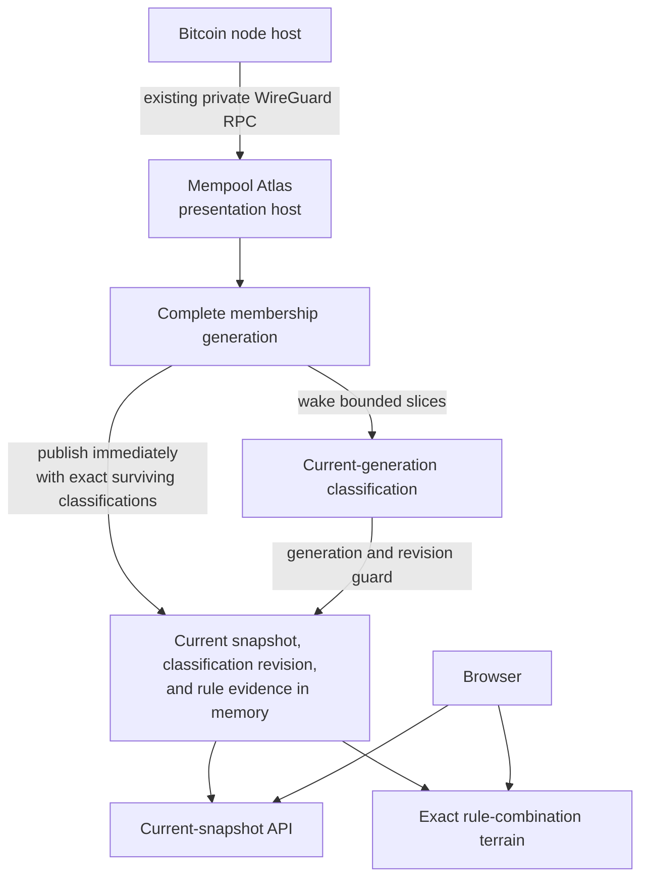

# Mempool Atlas

Mempool Atlas is a classification-first Bitcoin mempool viewer. It periodically
asks one Bitcoin node for its complete current mempool, evaluates current
transactions against the seven BIP-110 rules as deployed Bitcoin Knots mempool
policy, and serves the latest result from memory.

The first product slice deliberately does not collect transaction-arrival
events, retain history, archive evidence, or compare nodes. Those are separate
products that can consume the same snapshot contract later without complicating
the single-node viewer.

## How it works



The production deployment reuses the existing private WireGuard network and
the node's private nginx RPC proxy. No Atlas service, database, queue, ZMQ
subscriber, container, or new listener runs beside Bitcoin Core. Every
membership poll makes three calls:

1. `getmempoolinfo` checks the reported entry count.
2. `getrawmempool true` collects the complete current membership.
3. `getblockchaininfo` records the chain tip associated with the observation.

Membership polling and classification run independently. Atlas installs and
publishes each validated membership generation immediately, including any
classification whose exact `txid` and `wtxid` survived from the prior
generation. Fresh membership therefore never waits for new policy RPC work.

A second loop drains bounded classification slices for the current generation.
`getrawtransaction` supplies exact transaction bytes, and
`gettxout(txid, vout, false)` supplies confirmed prevout scripts while ignoring
mempool spends. Unconfirmed parents are read from their raw mempool
transactions. Atlas verifies both `txid` and `wtxid` before attaching any
result. Each slice prefers entries without any classification before retrying
carried partial results, and each witness variant is attempted at most once in
one membership generation. The next successful membership makes unresolved
current variants eligible again.

Incomplete enrichment never invalidates fresh membership. Entries not reached
yet, or whose raw transaction cannot be verified, remain explicitly
unclassified. A transaction with only some prevouts available keeps its proven
results and exposes typed unknowns for the gaps. Successful slices publish
progressive current-snapshot replacements. If a newer generation arrives while
work is in flight, the classifier stops scheduling new waves for the old
generation and both the policy coordinator and runtime reject its stale result.
Already buffered requests can still finish. If a slice makes no classification
progress and reports a systemic batch or all-response failure, Atlas pauses the
rest of that generation until the next successful membership instead of
rapidly repeating the failure.

Each published snapshot includes a membership-local
`classification_revision`, beginning at zero and advancing with progressive
classification. Transaction detail carries the same field. The browser pairs
the revision with `observed_at_ms`, source identity, `txid`, and `wtxid` before
showing rule evidence. A detail response from a later revision is safe only
when its compact assessment still exactly matches the visible transaction.
Older detail, changed assessments, and detail racing a locally refreshed
snapshot are not rendered.

A failed membership poll leaves the last good observation available and marks
it stale. A process restart simply waits for the next poll; there is no
application data to migrate or recover.

See [docs/architecture.md](docs/architecture.md) and
[ADR 0003](docs/adr/0003-periodic-in-memory-snapshots.md) for the system
boundary. [ADR 0004](docs/adr/0004-exact-rule-combination-buckets.md) records
the terrain's grouping semantics.

## Website

The primary website is a classification terrain:

- compatible, indeterminate, unclassified, complete violating, and incomplete
  violating sections partition the current source;
- complete violating assessments are bucketed by their canonical exact set of
  proven rules, while assessments with unresolved checks remain in separate
  partial buckets keyed by both proven and unknown rules;
- each transaction appears in exactly one terrain bucket, including
  transactions that violate more than one rule;
- rule filters are marginal and overlap, highlighting every bucket that
  contains the selected rule;
- count and virtual-size modes select the layout metric and transaction-tile
  area, while section and bucket frames retain readability weighting;
- coverage makes incomplete enrichment and evaluator unknowns visible;
- selecting a rule or any terrain bucket opens representative transactions
  and typed evidence;
- first rejection remains transaction-detail metadata and never chooses the
  transaction's terrain bucket;
- the original fee-rate by age view remains available as a secondary lens.

The browser never contacts the Bitcoin node and its refresh button does not
trigger a new RPC poll. It only fetches the latest snapshot already held by
Atlas.

## Development

Prerequisites are a current Rust toolchain, Node.js, npm, and `just`.

```bash
npm --prefix web install
just build
just test
just lint
```

Run the complete service with `just dev`. During frontend work, run that service
and `just web-dev` in separate terminals.

## Configuration

The service binds to loopback and is intended to sit behind the presentation
host's existing web proxy.

| Variable | Required | Default | Purpose |
| --- | --- | --- | --- |
| `ATLAS_SOURCE_ID` | yes | none | Stable, URL-safe source name |
| `ATLAS_SOURCE_LABEL` | no | source ID | Human-readable node name |
| `ATLAS_RPC_URL` | yes | none | Private Bitcoin RPC proxy URL |
| `ATLAS_RPC_USERNAME` | no | `atlas` | Dedicated least-privilege RPC user |
| `ATLAS_RPC_PASSWORD_FILE` | yes | none | One-line RPC password credential |
| `ATLAS_POLL_SECONDS` | no | `300` | Scheduled complete-membership interval |
| `ATLAS_MAX_MEMPOOL_ENTRIES` | no | `200000` | Preflight and decode entry limit |
| `ATLAS_CLASSIFICATION_SLICE_ENTRIES` | no | `2048` | Maximum witness variants attempted in one slice; range 1 to 8192 |
| `ATLAS_CLASSIFICATION_RPC_LANES` | no | `4` | Concurrent raw-transaction RPC batches; range 1 to 8 |
| `ATLAS_CLASSIFICATION_CACHE_MIB` | no | `256` | Auxiliary output-script cache admission; range 1 to 512 MiB |
| `ATLAS_BIND` | no | `127.0.0.1:3101` | Loopback API and website listener |
| `ATLAS_WEB_ROOT` | no | `web/dist` | Built website directory |

Example development configuration:

```bash
export ATLAS_SOURCE_ID=core
export ATLAS_SOURCE_LABEL="Bitcoin Core"
export ATLAS_RPC_URL=http://node-wireguard-address:9000/
export ATLAS_RPC_PASSWORD_FILE=/path/to/development-rpc-password
just dev
```

Do not commit addresses, host inventory, or credentials to this repository.
Deployment configuration owns those values.

## HTTP surface

- `GET /healthz` reports that the process is running.
- `GET /readyz` becomes ready after the first valid snapshot.
- `GET /api/v1/sources` returns source status and small snapshot metadata.
- `GET /api/v1/sources/{source_id}/mempool` returns status plus the current
  complete snapshot and its `classification_revision`.
- `GET /api/v1/sources/{source_id}/transactions/{txid}` returns the current
  compact assessment, typed evidence, and matching classification revision for
  one classified witness variant.

All API responses disable caching. Static website files are served by the same
process.

## Production acceptance

The application encodes one JSON response when snapshot state changes and
shares those immutable bytes between requests. This prevents concurrent
browsers from multiplying large serialization work and memory allocation.
The deployed presentation reverse proxy applies request and connection limits
plus response compression before public exposure.

Bitcoin RPC authentication does not make a credential read-only. Deployment
must apply a server-side RPC whitelist containing exactly
`getmempoolinfo`, `getrawmempool`, `getblockchaininfo`, `getrawtransaction`,
and `gettxout` for the Atlas user.
The existing private nginx path must stream the verbose response without
proxy-temp spill and use timeouts compatible with the validated collection
window.

`corepc-client` 0.8 buffers the verbose membership response and has a fixed
15-second transport timeout. Classification uses the `jsonrpc` crate's minreq
transport with a 20-second per-batch timeout. Raw transaction and mempool-parent
batches contain at most 256 requests and are split by an estimated 16 MiB
response target. Confirmed prevout batches have a nominal 512-request cap, but
the 16 MiB estimate and 64 KiB per-script-hex bound currently limit them to 254
requests. Returned transaction hex is limited to 8,000,000 characters. A batch
is rejected if its decoded JSON-RPC response envelope exceeds 16 MiB. The
transport has already buffered and parsed that response, so these are admission
guards rather than complete peak-memory limits. The deployment's 2 GiB memory
cgroup is the hard boundary for transient response buffering.

The default four raw RPC lanes are reduced to two lanes for confirmed prevout
batches. A slice defaults to 2,048 candidates and is capped at 8,192. Candidate
raw responses are admitted against a 256 MiB aggregate estimate. Mempool-parent
raw work has its own 8,192-transaction and 256 MiB estimated phase cap. Atlas
considers at most 65,536 unique required prevouts per slice. Confirmed-prevout
requests have a separate 256 MiB estimated aggregate cap, which permits 4,064
worst-case calls under the current 64 KiB plus 512-byte per-response estimate.
These phase estimates bound planned work, not transport allocation.

Classification drains slices until the current generation has been attempted,
is paused after systemic no-progress failure, or is replaced by newer
membership. It does not lengthen an otherwise on-schedule membership interval.
The first deployed membership-only slice accepted complete
28,520 to 33,381 entry snapshots over WireGuard in 6.9 to 15.4 seconds
end-to-end. Peak service memory after collection and a full browser load stayed
below 49 MB, with no proxy temporary files, swap, pressure, or OOM events. This
predates continuous classification and its auxiliary caches, and does not prove
the 200,000-entry limit will fit the service's 2 GiB production cgroup.
Revalidate the classified slice on the target before treating those earlier
measurements as current.

The five-minute default is intentionally not live. Choose the production
cadence from measured response bytes, transfer duration, node cost, and desired
freshness. Do not shorten it merely because the viewer can poll more often.

## Deliberate omissions

Attempt #3 has no SQLite database, migrations, event queue, delta protocol,
node-local agent, ZMQ subscriber, container, forensic evidence ingest,
historical archive, or comparison endpoint. It adds no network path beyond the
existing WireGuard RPC route. Git history preserves the earlier experiments
and their lessons.

Comparison is the next product slice. It will collect independent snapshots
using the same private transport and derive set differences at read time. It
must never describe absence from one node as proof of rejection, filtering, or
relay causality.
