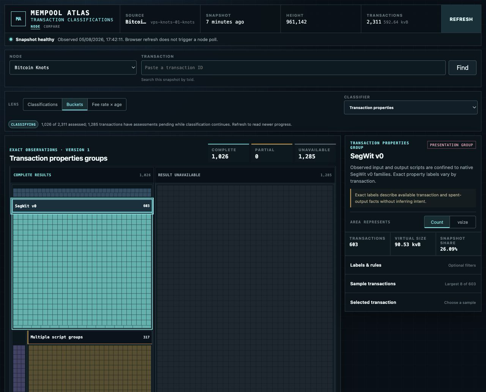
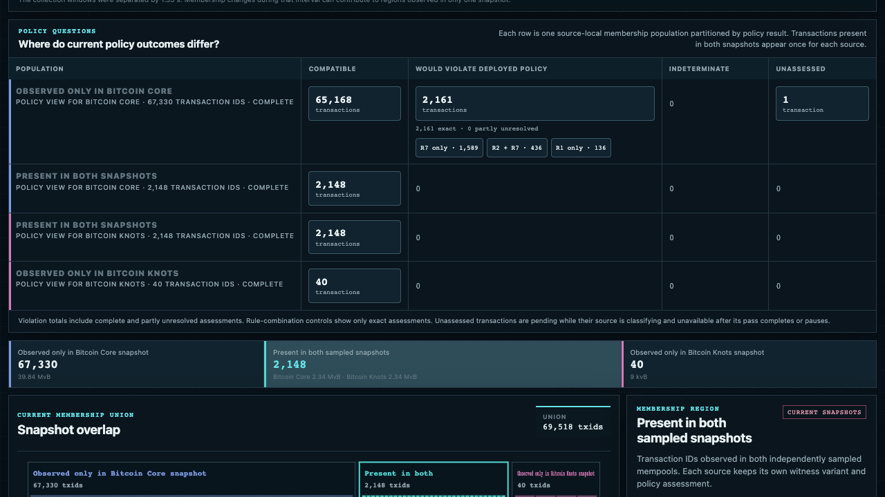

# Mempool Atlas

Mempool Atlas is a visual explorer for the current Bitcoin mempool. It applies
independent, versioned classification lenses to each current transaction, then
lets you compare snapshots from different nodes without treating their
mempools as one combined dataset.



## What it shows

- The complete current mempool reported by each configured Bitcoin node.
- Exact transaction properties, including version, witness, replaceability,
  P2A, and known input and output script families.
- Explainable transaction-shape heuristics for possible CoinJoin,
  consolidation, and batch payout patterns.
- Bounded fingerprints for inscriptions, BRC-20, Runes, Stamps, Counterparty,
  Omni, and otherwise unrecognized OP_RETURN carriers.
- Whether each transaction is compatible with the BIP-110 policy implemented
  by Bitcoin Knots, including rule evidence when an assessment is available.
- Readable presentation groups for the selected classifier. Transaction
  properties use broad script profiles, while exact labels remain available on
  every transaction and through marginal controls.
- A specialist BIP-110 presentation that preserves exact combinations of
  violated rules and the existing seven-rule evidence.
- Per-classifier coverage, so partial or unavailable results are not mistaken
  for negative matches.
- Fee rate, age, virtual size, source freshness, and transaction detail.
- Snapshot distributions derived in the browser, one panel per question: what
  the pool is made of (one composition bar per independent classifier lens),
  where the weight sits in fee space (a spectrum stacked by the selected
  classifier's buckets), what shape it is (a joint fee-rate-by-size density
  heatmap with marginals), how long it has waited (a bucket-by-age mosaic),
  what it would pay a miner (effective package fee rate from delta-adjusted
  ancestor fees), how much data it carries (OP_RETURN payload sizes by
  data-protocols bucket), how complex it is (an input-count by output-count
  density), how entangled it is (unconfirmed ancestor and descendant bands
  with the replaceability share), and how much value it moves (total output
  value by bucket).
- Per-transaction structure facts published with every snapshot: weight,
  in-mempool ancestry with delta-adjusted package fees, effective
  replaceability as reported by the source node, and progressively, input and
  output counts, OP_RETURN payload bytes, total output value, and witness
  bytes derived from the raw transaction. All of it is surfaced in
  transaction detail.
- An honesty banner naming the retained observation's age and poll failure
  whenever a source is stale, so a retained view is never mistaken for a
  fresh one.

The classifiers are independent. Atlas does not force structural properties,
heuristic intent, data-protocol fingerprints, and policy compatibility into one
universal transaction type. See the original
[classification specification](docs/classification.md) for exact rules,
thresholds, evidence, and limitations.

Policy compatibility is not consensus validity. A transaction that violates a
BIP-110 rule may still be consensus-valid, and absence from one sampled mempool
does not prove that a node rejected or filtered it.

## Compare independent mempools



The comparison page fetches two current source snapshots and derives three
membership regions in the browser: present in both, observed only on the left,
and observed only on the right. It shows each collection window and their
sampling skew because the observations are independent rather than
simultaneous.

Policy results remain source-local. A transaction common to both snapshots can
therefore have a different witness variant or assessment on each side.

Above the policy matrix, mirrored source-local distribution panels summarize
each snapshot on shared fixed axes across the same nine questions as the node
view, weighted by virtual size. A population scope selector restricts every
panel to the whole snapshot, the transactions present in both snapshots, or
the transactions observed in only one source. The panels describe each source
independently; they never merge the two mempools into one population.

## Architecture


One Atlas process polls a small configured set of Bitcoin RPC endpoints. It
publishes complete membership first, resolves bounded transaction and prevout
facts once, evaluates the independent classifier lenses, and keeps only the
latest successful observation for each source in memory. The same process
serves the API and static web application.

For public deployment, Atlas remains bound to loopback behind Cloudflare
Tunnel. Cloudflare supplies the public TLS, compression, cache, WAF, and rate-
limit boundary without exposing Bitcoin RPC or the Atlas listener.

There is no database, event queue, retained history, node-side agent, or
server-side combined mempool. The editable diagram is available as
[`docs/assets/architecture.drawio`](docs/assets/architecture.drawio).

See [Architecture](docs/architecture.md) for the data flow and invariants, and
[Configuration](docs/configuration.md) for the complete setup reference.

## Project status and direction

Atlas is preparing for its first public release. The current product supports
one to four Bitcoin sources, complete current-membership snapshots, progressive
multi-lens transaction classification, a classifier-driven bucket terrain with
a specialist source-local BIP-110 presentation, and browser-derived pairwise
comparison.

The near-term direction is to validate resource bounds and classifier behavior
against larger real mempools, keep policy behavior aligned with Bitcoin Knots,
improve accessibility and explanatory detail, and simplify installation and
packaging without weakening the node and credential boundary. Historical
capture and relay forensics remain deliberately separate from this viewer.

## Quick start

You need Rust 1.88 or newer, Node.js 20.19 or newer, npm 10 or newer, and
[`just`](https://github.com/casey/just). Your Bitcoin RPC endpoint must permit
`getblockchaininfo`, `getmempoolinfo`, `getrawmempool`, `getrawtransaction`,
and `gettxout`.

```bash
npm --prefix web ci
cp config/sources.example.json config/sources.json
cp .env.example .env
mkdir -p var/credentials
printf '%s\n' 'replace-with-rpc-password' > var/credentials/node-a.password
chmod 600 var/credentials/node-a.password
just build
just dev
```

Edit `config/sources.json` to match the RPC URL, username, label, and credential
filename for your node. Remove the second example source unless you also create
its credential file. Atlas listens on <http://127.0.0.1:3101> by default.

The standard project commands are:

```bash
just build
just test
just lint
just format
just clean
```

### Frontend development without a node

You can work on the web frontend without any configured Bitcoin node. Run
`just web-fixtures` in one terminal to serve a deterministic fixture Atlas API
on <http://127.0.0.1:3101>, then run `just web-dev` in another terminal. The
fixture API serves synthetic, deterministic snapshots for three sources that
satisfy the same public contract as a live Atlas process, so the frontend runs
exactly as it would against real nodes.

## API

- `GET /healthz` reports process health.
- `GET /readyz` becomes ready after the first valid snapshot.
- `GET /api/v1/sources` lists configured sources and current status.
- `GET /api/v1/sources/{source_id}/mempool` returns one current snapshot.
- `GET /api/v1/sources/{source_id}/transactions/{txid}` returns classifier and
  policy detail for one current transaction.

Source discovery, transaction detail, operational responses, and errors disable
caching. A published full snapshot has an `ETag` and requires revalidation, so
an unchanged conditional request returns `304` without transferring the full
JSON body. The browser refresh action reads Atlas' latest in-memory copy; it
does not trigger a Bitcoin RPC poll.

## Public deployment

The supported public boundary is Cloudflare Tunnel to the loopback Atlas
listener. See [Deploy behind Cloudflare](docs/deployment-cloudflare.md) for the
origin service, tunnel, cache rules, WAF, rate limits, security headers,
monitoring, smoke tests, and rollback procedure. Deployment credentials,
hostnames, private RPC addresses, and account identifiers must remain outside
this repository.

## Contributing

See [CONTRIBUTING.md](CONTRIBUTING.md) for the development workflow and
[SECURITY.md](SECURITY.md) for reporting vulnerabilities.

## License

Mempool Atlas is available under the [MIT License](LICENSE).
