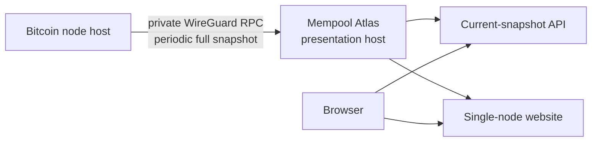

# Mempool Atlas

Mempool Atlas is a small Bitcoin mempool viewer. It periodically asks one
Bitcoin node for its complete current mempool, keeps only the latest successful
snapshot in memory, and serves both that snapshot and the website that explores
it.

The first product slice deliberately does not collect transaction-arrival
events, retain history, archive evidence, or compare nodes. Those are separate
products that can consume the same snapshot contract later without complicating
the single-node viewer.

## How it works



The production deployment reuses the existing private WireGuard network and
the node's private nginx RPC proxy. No Atlas service, database, queue, or
container runs beside Bitcoin Core. The presentation host makes three RPC calls
per poll:

1. `getmempoolinfo` checks the reported entry count.
2. `getrawmempool true` collects the complete current membership.
3. `getblockchaininfo` records the chain tip associated with the observation.

A complete successful poll atomically replaces the in-memory snapshot. A
failed poll leaves the last good snapshot available and marks it stale. A
process restart simply waits for the next poll; there is no application data to
migrate or recover.

See [docs/architecture.md](docs/architecture.md) and
[ADR 0003](docs/adr/0003-periodic-in-memory-snapshots.md) for the design
boundary.

## Website

The initial website is the recovered "swimming in the mempool" view:

- square area represents transaction virtual size;
- vertical position represents base fee rate;
- horizontal position and colour represent age at snapshot time;
- filters narrow the view by fee rate, age, and virtual size;
- the inspector finds transactions by txid without rendering a huge DOM table.

The browser never contacts the Bitcoin node and its refresh button does not
trigger a new RPC poll. It only fetches the latest snapshot already held by
Atlas.

## Development

Prerequisites are a current Rust toolchain, Node.js, npm, and `just`.

```bash
npm --prefix web install
just build
just test
just lint
```

Run the complete service with `just dev`. During frontend work, run that service
and `just web-dev` in separate terminals.

## Configuration

The service binds to loopback and is intended to sit behind the presentation
host's existing web proxy.

| Variable | Required | Default | Purpose |
| --- | --- | --- | --- |
| `ATLAS_SOURCE_ID` | yes | none | Stable, URL-safe source name |
| `ATLAS_SOURCE_LABEL` | no | source ID | Human-readable node name |
| `ATLAS_RPC_URL` | yes | none | Private Bitcoin RPC proxy URL |
| `ATLAS_RPC_USERNAME` | no | `atlas` | Dedicated least-privilege RPC user |
| `ATLAS_RPC_PASSWORD_FILE` | yes | none | One-line RPC password credential |
| `ATLAS_POLL_SECONDS` | no | `300` | Delay between complete polls |
| `ATLAS_MAX_MEMPOOL_ENTRIES` | no | `200000` | Preflight and decode entry limit |
| `ATLAS_BIND` | no | `127.0.0.1:3101` | Loopback API and website listener |
| `ATLAS_WEB_ROOT` | no | `web/dist` | Built website directory |

Example development configuration:

```bash
export ATLAS_SOURCE_ID=core
export ATLAS_SOURCE_LABEL="Bitcoin Core"
export ATLAS_RPC_URL=http://node-wireguard-address:9000/
export ATLAS_RPC_PASSWORD_FILE=/path/to/development-rpc-password
just dev
```

Do not commit addresses, host inventory, or credentials to this repository.
Deployment configuration owns those values.

## HTTP surface

- `GET /healthz` reports that the process is running.
- `GET /readyz` becomes ready after the first valid snapshot.
- `GET /api/v1/sources` returns source status and small snapshot metadata.
- `GET /api/v1/sources/{source_id}/mempool` returns status plus the current
  complete snapshot.

All API responses disable caching. Static website files are served by the same
process.

## Production acceptance

The application encodes one JSON response when snapshot state changes and
shares those immutable bytes between requests. This prevents concurrent
browsers from multiplying large serialization work and memory allocation.
The deployed presentation reverse proxy applies request and connection limits
plus response compression before public exposure.

Bitcoin RPC authentication does not make a credential read-only. Deployment
must apply a server-side RPC whitelist containing exactly
`getmempoolinfo`, `getrawmempool`, and `getblockchaininfo` for the Atlas user.
The existing private nginx path must stream the verbose response without
proxy-temp spill and use timeouts compatible with the validated collection
window.

`corepc-client` 0.8 buffers the verbose response and has a fixed 15-second
transport timeout. The first deployed single-source slice accepted complete
28,520 to 33,381 entry snapshots over WireGuard in 6.9 to 15.4 seconds
end-to-end. Peak service memory after collection and a full browser load stayed
below 49 MB, with no proxy temporary files, swap, pressure, or OOM events. This
does not prove the 200,000-entry limit will fit the fixed transport timeout.
Revalidate materially larger mempools before adding sources; if collection
cannot finish reliably, replace or extend the RPC transport rather than
weakening snapshot validation.

The five-minute default is intentionally not live. Choose the production
cadence from measured response bytes, transfer duration, node cost, and desired
freshness. Do not shorten it merely because the viewer can poll more often.

## Deliberate omissions

Attempt #3 has no SQLite database, migrations, event queue, delta protocol,
node-local agent, forensic evidence ingest, historical archive, or comparison
endpoint. Git history preserves the earlier experiments and their lessons.

Comparison is the next product slice. It will collect independent snapshots
using the same private transport and derive set differences at read time. It
must never describe absence from one node as proof of rejection, filtering, or
relay causality.
