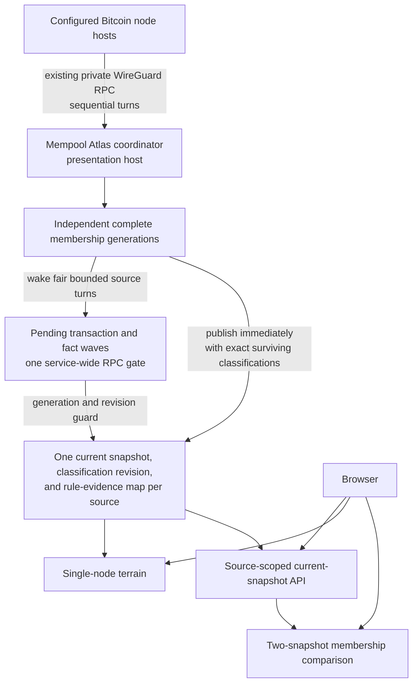

# Mempool Atlas

Mempool Atlas is a classification-first Bitcoin mempool viewer. It periodically
asks a small configured set of Bitcoin nodes for their complete current
mempools, evaluates current transactions against the seven BIP-110 rules as
deployed Bitcoin Knots mempool policy, and serves each latest result from
memory.

The node viewer and the separate comparison page share that source-scoped
snapshot infrastructure. Atlas deliberately does not collect transaction-
arrival events, retain history, or archive evidence. Archival remains a
separate product with a different lifecycle.

## How it works



The production deployment reuses the existing private WireGuard network and
each node's private nginx RPC proxy. No Atlas service, database, queue, ZMQ
subscriber, container, or new listener runs beside the Bitcoin nodes. Every
membership poll makes four calls:

1. `getblockchaininfo` records the starting chain tip.
2. `getmempoolinfo` checks the reported entry count.
3. `getrawmempool true` collects the complete current membership.
4. `getblockchaininfo` requires the same ending chain tip.

One coordinator polls configured sources sequentially in a deterministic
round. A source failure leaves its last good snapshot visible and does not stop
later sources. The successful snapshot records its collection start,
completion, and duration. A tip change rejects that poll instead of publishing
a block-boundary mixture.

Membership and classification share one service-wide RPC gate. A due
membership round polls every source before classification resumes.
Classification then advances source-local generations round-robin in bounded
slices. Atlas installs and publishes each validated membership generation
immediately, including any classification whose exact `txid` and `wtxid`
survived from the prior generation. Fresh membership therefore never waits for
new policy RPC work.

A second loop drains bounded candidate windows and fact waves for the current
generation. `getrawtransaction` supplies exact transaction bytes, and
`gettxout(txid, vout, false)` supplies confirmed prevout scripts while ignoring
mempool spends. Unconfirmed parents are read from their raw mempool
transactions. Atlas verifies both `txid` and `wtxid` before retaining a raw
candidate. That candidate remains pending in the same generation while fair,
bounded waves resolve its scripts from exact current-parent outputs, a bounded
positive prevout cache, or the node. Crossing a wave boundary does not refetch
the candidate transaction.

Incomplete enrichment never invalidates fresh membership. Entries not reached
yet, or whose raw transaction cannot be verified, remain explicitly
unclassified. Capacity deferral, unscheduled work, RPC failure, malformed or
oversized data, and absent response envelopes remain collection state and leave
`bip110` as `null`. A successful null-shaped `gettxout` response from the
trusted Bitcoin Core endpoint is a genuine missing script fact only for an
outpoint known not to be a current mempool parent. The JSON-RPC `result` member
must be present for that null to be authoritative; an omitted member is failed
collection work. A null fallback after parent-raw failure is ambiguous and
remains operationally unresolved until its bounded attempts are exhausted.
Atlas evaluates a candidate only after every required script is present or has
a genuine terminal result.

Fact-only progress continues without publishing a new snapshot revision.
Completed assessments publish progressive current-snapshot replacements. The
drain explicitly reports continue, complete, paused, or stale: eligible work
continues unless a systemic circuit breaker fires; a candidate that exhausts
two attempts for one fact source in its bounded pending window is deferred for
the rest of that generation so later candidates can continue; no eligible work
completes the generation; a systemic RPC failure pauses it; and replacement
membership stops stale work.
Deferred candidates remain unclassified and become eligible again after the
next successful membership observation. Already buffered stale requests may
finish, but their results cannot update current state or the shared positive
cache.

The evaluator models P2SH directly. The final scriptSig item is the exempt
redeemScript blob, while earlier scriptSig items and pushes within the
redeemScript remain subject to rule 2. Exact P2SH-P2WPKH and P2SH-P2WSH forms
dispatch through nested witness evaluation. P2SH-wrapped witness versions 1
through 16 follow rule 3 because the deployed policy enables Taproot and P2A
only for native witness programs.

Each published snapshot includes a membership-local
`classification_revision`, beginning at zero and advancing with progressive
classification. Transaction detail carries the same field. The browser pairs
the revision with `observed_at_ms`, source identity, `txid`, and `wtxid` before
showing rule evidence. A detail response from a later revision is safe only
when its compact assessment still exactly matches the visible transaction.
Older detail, changed assessments, and detail racing a locally refreshed
snapshot are not rendered.

A failed membership poll leaves the last good observation available and marks
it stale. A process restart simply waits for the next poll; there is no
application data to migrate or recover.

See [docs/architecture.md](docs/architecture.md) and
[ADR 0003](docs/adr/0003-periodic-in-memory-snapshots.md) for the system
boundary. [ADR 0004](docs/adr/0004-exact-rule-combination-buckets.md) records
the terrain's grouping semantics. [ADR 0005](docs/adr/0005-resolve-policy-facts-before-evaluation.md)
supersedes ADR 0003's attempt-once classification details with the pending fact
resolver and P2SH semantics. [ADR 0006](docs/adr/0006-own-policy-json-rpc-wire-boundary.md)
records the bounded, presence-preserving classification transport.
[ADR 0007](docs/adr/0007-browser-derived-snapshot-comparison.md) records the
bounded multi-source coordinator and browser-derived snapshot comparison.

## Website

The primary website is a classification terrain:

- compatible, indeterminate, unclassified, complete violating, and incomplete
  violating sections partition the current source;
- complete violating assessments are bucketed by their canonical exact set of
  proven rules, while assessments with unresolved checks remain in separate
  partial buckets keyed by both proven and unknown rules;
- each transaction appears in exactly one terrain bucket, including
  transactions that violate more than one rule;
- rule filters are marginal and overlap, highlighting every bucket that
  contains the selected rule;
- count and virtual-size modes select the layout metric and transaction-tile
  area, while section and bucket frames retain readability weighting;
- coverage makes incomplete enrichment and evaluator unknowns visible;
- selecting a rule or any terrain bucket opens representative transactions
  and typed evidence;
- a visible source selector exposes every configured node, while txid search
  jumps to a transaction's canonical terrain region and keeps the selected
  glyph and inspector addressable;
- first rejection remains transaction-detail metadata and never chooses the
  transaction's terrain bucket;
- the original fee-rate by age view remains available as a secondary lens.

The browser never contacts the Bitcoin node and its refresh button does not
trigger a new RPC poll. It only fetches the latest snapshot already held by
Atlas. Node URLs canonically encode the source, selected rule or terrain region,
and transaction. Refresh preserves valid exploration state, and a well-formed
txid that is absent from the current snapshot remains visible as an explicit
search result rather than being silently discarded.

The comparison page is a separate product surface. It fetches two complete
source snapshots and merges their sorted transaction IDs in the browser. Every
transaction appears once in one of three regions: present in both sampled
snapshots, observed only in the left snapshot, or observed only in the right
snapshot. The page shows both collection windows, observation skew, chain-tip
agreement, freshness, and source-specific totals. Common transaction IDs retain
both source-local witness variants and assessments. Pair changes abort obsolete
full-snapshot reads. Selection-only paints reuse Canvas geometry, and a bounded
virtual transaction navigator makes every region entry keyboard-reachable
without adding one DOM node per transaction.

Comparison URLs canonically encode the source pair, membership region,
source-local policy side, policy filter, and transaction. Each source summary
links back to its node view, and txid search locates a transaction across the
three sorted membership regions without retaining a duplicate union-sized
index. Refresh preserves valid comparison state, while an intentional source-
pair change clears the prior investigation.

Membership differences are observations, not rejection evidence. The page does
not infer filtering, relay causality, or relative permissiveness from absence in
one sampled snapshot.

## Development

Prerequisites are a current Rust toolchain, Node.js, npm, and `just`.

```bash
npm --prefix web install
just build
just test
just lint
```

Run the complete service with `just dev`. During frontend work, run that service
and `just web-dev` in separate terminals.

## Configuration

The service binds to loopback and is intended to sit behind the presentation
host's existing web proxy.

| Variable | Required | Default | Purpose |
| --- | --- | --- | --- |
| `ATLAS_SOURCES_FILE` | yes | none | Root-controlled JSON file containing one to four source records |
| `ATLAS_CREDENTIALS_DIRECTORY` | yes | none | Directory containing the named one-line RPC password credentials |
| `ATLAS_POLL_SECONDS` | no | `300` | Scheduled complete-membership interval |
| `ATLAS_MAX_MEMPOOL_ENTRIES` | no | `200000` | Preflight and decode entry limit |
| `ATLAS_CLASSIFICATION_SLICE_ENTRIES` | no | `2048` | Maximum witness variants admitted into one pending candidate window; range 1 to 8192 |
| `ATLAS_CLASSIFICATION_RPC_LANES` | no | `4` | Concurrent raw-transaction RPC batches; range 1 to 8 |
| `ATLAS_CLASSIFICATION_TOTAL_CACHE_MIB` | no | `256` | Service-wide source-cache budget divided among configured sources; range 1 to 512 MiB |
| `ATLAS_BIND` | no | `127.0.0.1:3101` | Loopback API and website listener |
| `ATLAS_WEB_ROOT` | no | `web/dist` | Built website directory |

The source file has this non-secret shape:

```json
{
  "sources": [
    {
      "source_id": "core",
      "source_label": "Bitcoin Core",
      "rpc_url": "http://127.0.0.1:18443/",
      "rpc_username": "atlas",
      "rpc_password_credential": "core-password"
    }
  ]
}
```

Example development environment:

```bash
export ATLAS_SOURCES_FILE=/path/to/sources.json
export ATLAS_CREDENTIALS_DIRECTORY=/path/to/credential-directory
just dev
```

Do not commit addresses, host inventory, or credentials to this repository.
Deployment configuration owns those values.

## HTTP surface

- `GET /healthz` reports that the process is running.
- `GET /readyz` becomes ready after the first valid snapshot.
- `GET /api/v1/sources` returns source status and small snapshot metadata.
- `GET /api/v1/sources/{source_id}/mempool` returns status plus the current
  complete snapshot and its `classification_revision`.
- `GET /api/v1/sources/{source_id}/transactions/{txid}` returns the current
  compact assessment, typed evidence, and matching classification revision for
  one classified witness variant.
- `GET /compare/` serves the separate browser-derived comparison product.

All API responses disable caching. Static website files are served by the same
process.

## Production acceptance

The application encodes one JSON response when snapshot state changes and
shares those immutable bytes between requests. This prevents concurrent
browsers from multiplying large serialization work and memory allocation.
The deployed presentation reverse proxy applies request and connection limits
plus response compression before public exposure.

Bitcoin RPC authentication does not make a credential read-only. Deployment
must apply a server-side RPC whitelist containing exactly
`getmempoolinfo`, `getrawmempool`, `getblockchaininfo`, `getrawtransaction`,
and `gettxout` for the Atlas user.
The existing private nginx path must stream the verbose response without
proxy-temp spill and use timeouts compatible with the validated collection
window. Classification responses must not use `Transfer-Encoding`; the current
proxy deliberately uses close-delimited responses, which Atlas bounds while
reading.

`corepc-client` 0.8 buffers the verbose membership response and has a fixed
15-second transport timeout. Classification uses an Atlas-owned `minreq`
transport with a 20-second per-batch timeout and disabled redirects. It
requires HTTP 200 and the Bitcoin Core JSON-RPC 2.0 envelope shape, preserves
the presence of both `result` and `error`, and restores out-of-order responses
by globally unique numeric request ID. Duplicate or unexpected IDs and excess
responses reject the batch. A valid error takes precedence over any
simultaneous result. Literal `result: null`, omitted `result`, and a present
value therefore remain three different outcomes.

Raw transaction and mempool-parent batches contain at most 256 requests and are
split by an estimated 16 MiB response target. Confirmed prevout batches have a
nominal 512-request cap, but the 16 MiB estimate and 64 KiB per-script-hex bound
currently limit them to 254 requests. Returned transaction hex is limited to
8,000,000 characters. Classification responses reject `Transfer-Encoding` and
are capped at 16 MiB before JSON parsing. Atlas rejects a declared length above
the cap before reading the body and rejects premature EOF against a declaration.
A close-delimited body aborts on the first byte beyond 16 MiB and must then
decode as one complete JSON batch. The deployment's 2 GiB memory cgroup remains
the boundary for concurrent responses, the separately buffered membership
path, and total process memory.

The default four raw RPC lanes are reduced to two lanes for confirmed prevout
batches. A pending candidate window defaults to 2,048 variants and is capped at
8,192. Candidate raw responses are admitted against a 256 MiB aggregate
estimate. Mempool-parent raw work has its own 8,192-transaction and 256 MiB
estimated wave cap. Atlas uses 65,536 unique required prevouts as the target per
pending window, but admits one candidate when that transaction alone exceeds
the count target; its raw and retained-script byte bounds still apply. Each
confirmed-prevout fact wave has a separate 256 MiB estimated aggregate cap,
which permits 4,064 worst-case calls under the current 64 KiB plus 512-byte
per-response estimate. Facts postponed by wave bounds remain pending and
continue fairly within the same membership generation. A candidate whose fact
cannot be admitted under a hard retained-script bound is eventually deferred
for that generation rather than exposed as an evaluator unknown or allowed to
block later candidates. Capacity recovery is bounded by the pending candidate
count and yields between relief passes while preserving facts already fetched
in the current call. These estimates bound planned work, not transport
allocation.

The configured total auxiliary cache budget is divided among sources. Each
source share covers exact current-transaction outputs and positive confirmed
`OutPoint` scripts. Positive confirmed facts may survive membership generations
and are evicted when necessary; nulls and failures are never cached. Each
source's retained pending scripts have a separate ceiling equal to the smaller
of its share and 256 MiB.
Unresolved fact indexes, pending raw transactions, bounded policy response
bodies, the separately buffered membership response, classifications, the
encoded snapshot, allocator overhead, and overlapping readers remain outside
both bounds.

Classification drains according to an explicit continue, complete, paused, or
stale disposition. Fact-only progress continues without publishing a snapshot
revision, locally exhausted candidates are counted and deferred, systemic RPC
failure pauses the generation, and replacement membership stops stale work.
Membership and classification never issue RPC work concurrently. A due
membership round takes the gate after the currently running bounded
classification slice, polls all sources sequentially, and then lets
round-robin classification resume.
Logs expose `fact_requests`, `facts_resolved`, `facts_missing`,
`capacity_deferred`, `deferred_candidates`, `response_failures`,
`systemic_response_failures`, `missing_responses`, `batch_failures`, and
`response_bytes` separately.

The first deployed membership-only slice accepted complete
28,520 to 33,381 entry snapshots over WireGuard in 6.9 to 15.4 seconds
end-to-end. Peak service memory after collection and a full browser load stayed
below 49 MB, with no proxy temporary files, swap, pressure, or OOM events. This
predates continuous classification and its auxiliary caches, and does not prove
the 200,000-entry limit will fit the service's 2 GiB production cgroup.
Revalidate the classified slice on the target before treating those earlier
measurements as current.

The five-minute default is intentionally not live. Choose the production
cadence from measured response bytes, transfer duration, node cost, and desired
freshness. Do not shorten it merely because the viewer can poll more often.

## Deliberate omissions

Attempt #3 has no SQLite database, migrations, event queue, delta protocol,
node-local agent, ZMQ subscriber, container, forensic evidence ingest,
historical archive, server-side comparison projection, or comparison cache. It
adds no network path beyond the existing WireGuard RPC routes. Git history
preserves the earlier experiments and their lessons.
