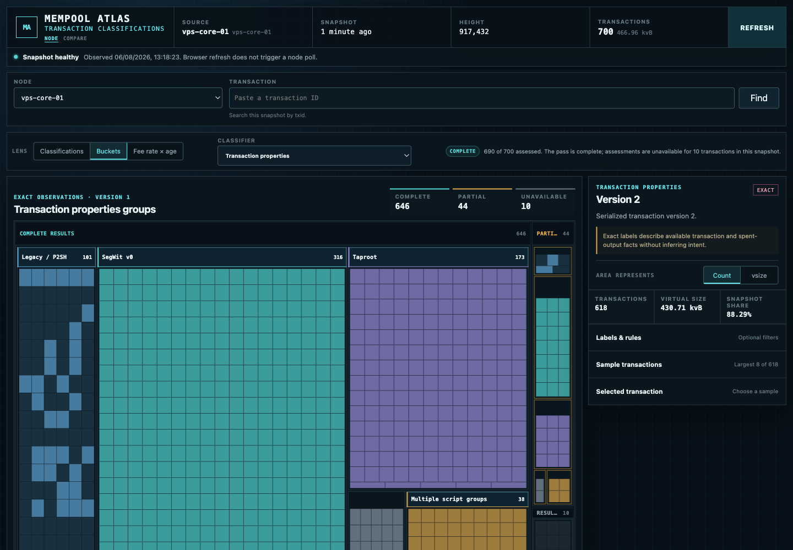
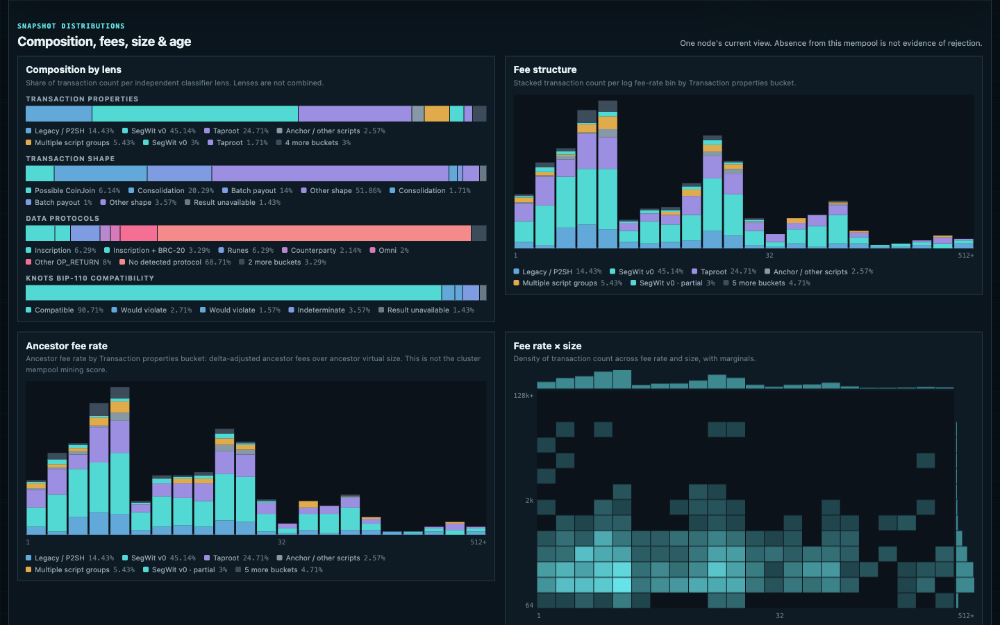
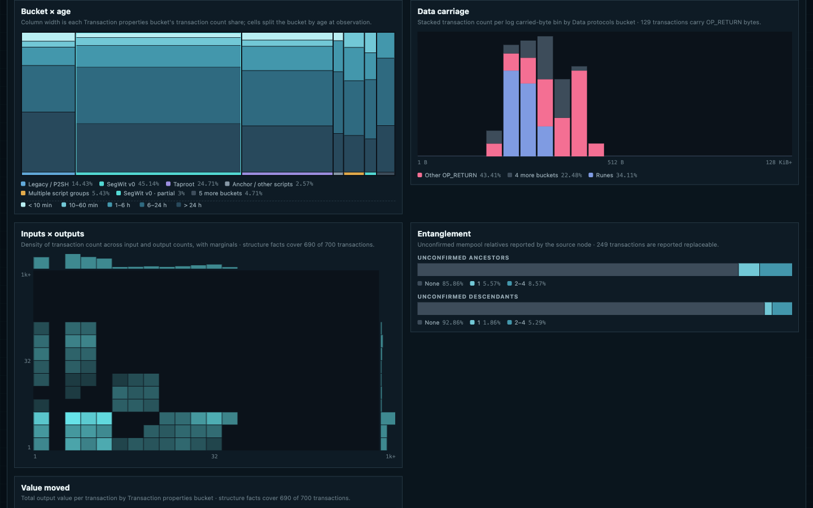
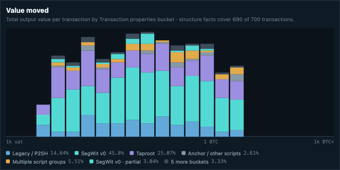
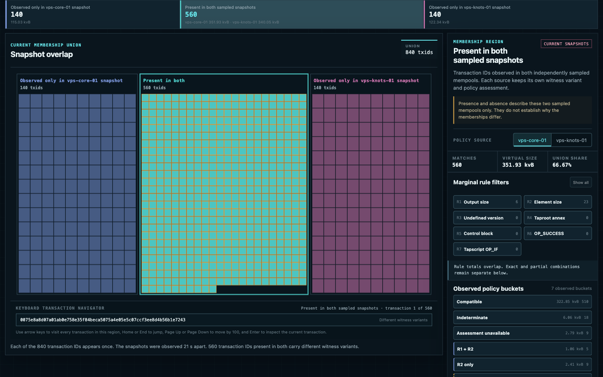
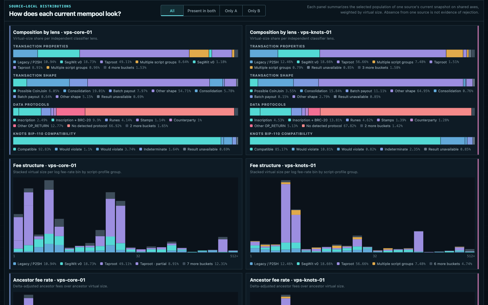
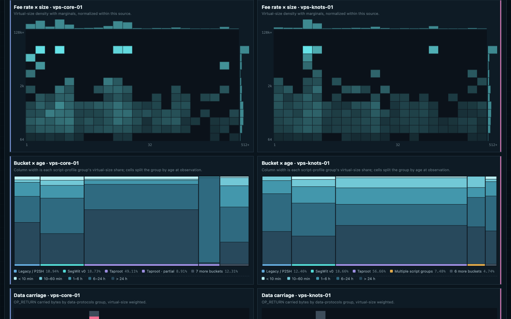
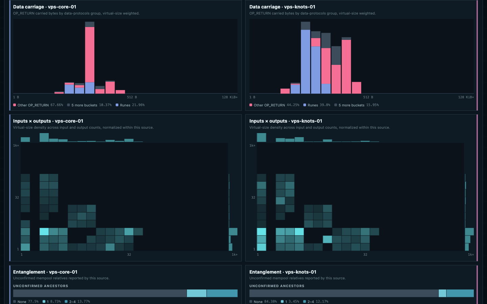
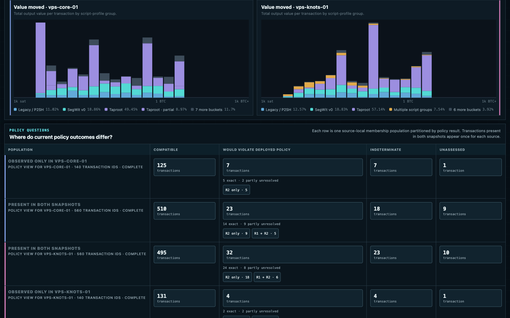

# Mempool Atlas

Mempool Atlas shows the current mempool reported by one to four Bitcoin nodes.
It classifies each transaction through five independent lenses. Comparison
happens in the browser; the server never combines mempools.



## What it shows

| Lens                   | Question                                                                                |
| ---------------------- | --------------------------------------------------------------------------------------- |
| Transaction properties | Which exact version, witness, replaceability, and script-family properties are present? |
| Transaction shape      | Which conservative CoinJoin, consolidation, or batch-payout heuristics match?           |
| Data protocols         | Which supported inscription, token, or OP_RETURN byte patterns are present?             |
| Data carriage shapes   | Which high-confidence witness or output-field carrier shapes are present?                 |
| Knots BIP-110          | Would this witness variant violate Bitcoin Knots' deployed policy?                      |

Atlas also shows fee rate, age, virtual size, ancestor fee rate, ancestry,
replaceability, structure facts, and transaction detail. The browser builds
the distribution charts from the current snapshot. Node selection, current
source facts, and transaction lookup share one source panel, matching the
selector-to-details hierarchy used by Compare.

In the default Classifications view, label cards are query controls. Select one
or more labels from the active classifier, combine them with ANY or ALL, and
inspect the full matching population as complete and partial transaction
blocks. Choosing a block, or reaching it by keyboard, opens that transaction's
detail without replacing the active query. The selected labels and match mode
are preserved in the page URL. In ALL mode, Atlas dims labels that cannot occur
with the current selection while keeping selected labels available for removal.
Independent classifier taxonomies are never combined.

Partial and unavailable results are reported separately, not counted as
negatives. The
[classification specification](docs/classification.md) defines the rules,
thresholds, evidence, and limits.

Policy compatibility is not consensus validity. A transaction that violates a
BIP-110 rule may still be consensus-valid, and absence from one sampled mempool
does not prove that a node rejected or filtered it.

## Snapshot distributions

Hover or focus any plotted region for exact bin ranges and population shares.
Click a spectrum or density cell to pin it while comparing panels; keyboard
users can traverse chart bins with the arrow keys. Quantitative charts name
both axes, and spectra show the active count or virtual-size scale vertically.
Data-carriage references
distinguish the historical 40-byte payload limit from the conventional
80-byte payload that serializes to an 83-byte OP_RETURN script.

On Compare, the node-by-node distribution section keeps its classifier lens,
Count/vsize metric, and membership population controls beside the charts they
govern. Selecting a composition segment changes the local lens and bucket for
the other distribution panels without changing the primary membership or
policy comparison.







## Compare independent mempools

Opening Atlas without URL state starts with the Bitcoin Core versus Bitcoin
Knots comparison. Explicit `?source=...` URLs continue to open the single-node
viewer, and the Node control in Compare opens its current left-hand source.

The comparison page fetches two snapshots and derives three regions in the
browser: present in both, observed only on the left, and observed only on the
right. Within the shared region, it also derives overlapping counts for
different witness variants, unconfirmed ancestor packages, and effective
replaceability directly from the two packed source snapshots. Outlined cells
carry at least one such difference, and selected transaction detail names the
exact source-local values. Snapshot timing states which source was observed
later and whether the two collection windows overlapped. A prominent txid
lookup immediately below that context opens one transaction across both
current snapshots. The lookup and three membership populations share one
transaction panel. Selected transaction IDs in both Node and Compare link to
their transaction page on mempool.space.

Both products render the lightweight current source metadata before their full
snapshot bodies arrive. The comparison page keeps its primary membership
workspace ahead of secondary distributions and the policy matrix, so those
derived panels cannot displace the interactive view as they populate.
The status strip below the Node/Compare switch remains visible: Node summarizes
the current snapshot and chain tip, while Compare summarizes the selected pair,
membership overlap, and whether both observations share a chain tip. Loading,
stale, and failure states replace that summary with current operational context.
Both browser products share a footer linking to the public source repository
and the author's X and Nostr profiles.

Each side keeps its own witness variant and policy assessment. Presence or
absence describes the sampled mempools only. It does not prove that a node
accepted, rejected, filtered, or relayed a transaction.












## Architecture


One Atlas process polls the configured Bitcoin RPC endpoints, publishes
complete membership, then fills in classifier results. It keeps only the
latest successful observation for each source in memory and serves both the
API and website.

For public deployment, Atlas remains bound to loopback behind Cloudflare
Tunnel. Cloudflare supplies the public TLS, compression, cache, WAF, and rate-
limit boundary without exposing Bitcoin RPC or the Atlas listener.

There is no database, retained history, node-side agent, or server-side
combined mempool. The editable diagram is
[`docs/assets/architecture.drawio`](docs/assets/architecture.drawio).

See [Architecture](docs/architecture.md) for the data flow and
[Configuration](docs/configuration.md) for setup.

## Quick start

You need Rust 1.88 or newer, Node.js 20.19.x or 22.12 or newer, npm 10 or newer,
and [`just`](https://github.com/casey/just). Your Bitcoin RPC endpoint must permit
`getblockchaininfo`, `getmempoolinfo`, `getrawmempool`, `getrawtransaction`,
and `gettxout`.

```bash
npm --prefix web ci
cp config/sources.example.json config/sources.json
cp .env.example .env
mkdir -p var/credentials
printf '%s\n' 'replace-with-rpc-password' > var/credentials/node-a.password
chmod 600 var/credentials/node-a.password
just build
just dev
```

Edit `config/sources.json` to match the RPC URL, username, label, and credential
filename for your node. Remove the second example source unless you also create
its credential file. Atlas listens on <http://127.0.0.1:3101> by default.

The example configures two mainnet nodes, and that is deliberate: every source
you configure must observe the same Bitcoin network. Comparing a mainnet
mempool against a testnet or signet one is meaningless, because the two
mempools describe unrelated chains. Atlas does not check this for you today.

`config/sources.json` and the `*.password` credential files are ignored by Git.
Keep RPC addresses, usernames, credentials, and host inventory out of commits.

Common commands:

```bash
just build
just test
just lint
just format
just clean
```

### Frontend development without a node

Run `just web-fixtures` in one terminal and `just web-dev` in another. The
command first exports three deterministic synthetic sources from the Rust
domain model, then serves their pre-encoded API bodies on
<http://127.0.0.1:3101>. `just test-web-e2e` regenerates the same small profile
automatically and always starts a fresh fixture server. Stop `just web-fixtures`
before running E2E; the preflight reports occupied fixture and preview ports
without reusing their existing processes.

`just perf-web` builds the production website and measures it against a
separate 70,000-transaction, two-source profile under recorded desktop and
mobile conditions. Results are written to `web/.perf-results/latest.json`.
See [client performance](docs/client-performance.md) for the measurement
contract, reconciled baseline, and current checkpoints.

## API

- `GET /healthz` reports process health.
- `GET /readyz` becomes ready after the first valid snapshot.
- `GET /api/v2/sources` reports the running Atlas version and lists configured
  sources with their current status.
- `GET /api/v2/sources/{source_id}/mempool` returns the current publication
  manifest.
- `GET /api/v2/sources/{source_id}/mempool/stages/{kind}/{content_id}` returns a
  content-addressed population, membership, or structure stage.
- `GET /api/v2/sources/{source_id}/mempool/stages/classifier/{classifier_id}/{content_id}`
  returns one content-addressed classifier stage.
- `GET /api/v2/sources/{source_id}/transactions/{txid}` returns classifier and
  policy detail for one current transaction.

Source discovery, transaction detail, operational responses, and errors disable
caching. Published manifests have `ETag` validators and require revalidation.
Successful stage responses use their SHA-256 content ID in the URL and remain
fresh and immutable for one year. Stage validators remain available, so an
explicit matching conditional request returns `304` without transferring the
JSON body. The browser refresh action reads Atlas' latest in-memory publication;
it does not trigger a Bitcoin RPC poll.

## Public deployment

Public deployment uses Cloudflare Tunnel to reach the loopback Atlas listener.
See [Deploy behind Cloudflare](docs/deployment-cloudflare.md) for setup and the
smoke test. A deployment can enable a self-hosted Umami tracker at build time;
analytics is disabled by default. Keep deployment credentials, hostnames,
private RPC addresses, and account identifiers out of this repository.
The production HTML publishes canonical Node and Compare URLs, page-specific
Open Graph and X cards, browser and touch icons, a web manifest, `robots.txt`,
and a sitemap for `atlas.deadmanoz.xyz`.

## Contributing

See [CONTRIBUTING.md](CONTRIBUTING.md) for the development workflow and
[SECURITY.md](SECURITY.md) for reporting vulnerabilities.

## License

Mempool Atlas is available under the [MIT License](LICENSE). Vendored
third-party material and its upstream notices are listed in
[THIRD_PARTY_NOTICES.md](THIRD_PARTY_NOTICES.md).
