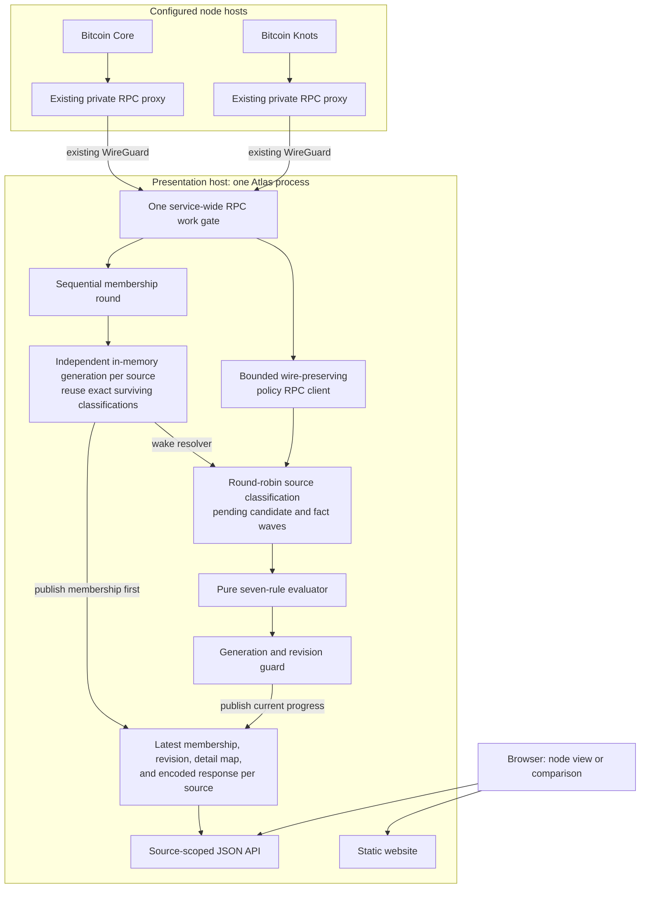

# Architecture

Mempool Atlas attempt #3 is one central process on the presentation host and a
dependency-light browser client. The process keeps one current snapshot for
each of one to four configured Bitcoin nodes, including bounded classification
of current witness variants against the seven BIP-110 rules as deployed Bitcoin
Knots mempool policy. The browser exposes a source-local node viewer and a
separate comparison of two independently sampled current snapshots.

[ADR 0005](adr/0005-resolve-policy-facts-before-evaluation.md) defines the
pending fact resolver, explicit-null semantics, positive prevout cache, and
P2SH evaluation described here. It supersedes ADR 0003's attempt-once
classification details. [ADR 0006](adr/0006-own-policy-json-rpc-wire-boundary.md)
defines the policy transport and HTTP framing contract.
[ADR 0007](adr/0007-browser-derived-snapshot-comparison.md) defines bounded
multi-source coordination and browser-derived comparison.

## One process on the presentation host

`apps/atlas/` owns collection, current state, the API, and static file serving:

- `rpc.rs` brackets `getmempoolinfo` and verbose `getrawmempool` with matching
  `getblockchaininfo` calls, records the complete collection window, and rejects
  a chain-tip change through `corepc-client`.
- `policy_rpc.rs` sends authenticated policy batches through lazy `minreq`
  reads. It owns response-byte limits, redirect refusal, request IDs, Bitcoin
  Core JSON-RPC 2.0 envelope validation, and the distinction between missing,
  null, and value result members.
- `policy.rs` resolves bounded windows of current witness variants through
  batched concurrent `getrawtransaction` and
  `gettxout(txid, vout, false)` calls. It owns same-generation pending fact
  waves, exact surviving classification reuse, bounded positive script caches,
  and stale result rejection.
- `model.rs` defines the complete flat snapshot, compact classification, and
  typed transaction-detail contracts.
- `runtime.rs` runs membership and classification as independent loops under
  one service-wide RPC gate. Membership rounds poll sources sequentially in
  configured order. Classification advances successful source-local
  generations round-robin in bounded slices, releasing the gate between
  slices. Membership is published before new policy work, and each successful
  current-generation assessment publication atomically replaces that source's
  snapshot and matching detail map with a strictly newer revision.
- `api.rs` exposes health, readiness, source discovery, current membership,
  current transaction detail, and the built website.
- `main.rs` validates a bounded JSON source file, loads each named credential
  from a separate directory, divides one total classification cache budget
  among sources, and owns the loopback listener and graceful shutdown.

`crates/rdts-rules/` is a pure evaluator. It has no I/O, async state, chain
access, or clock. It exposes separate consensus and mempool-policy modes. Atlas
uses only the mempool-policy mode, which applies all seven rules without a
deployment activation gate or UTXO grandfathering.

The executable accepts one to four sources. `SourceRegistry` keeps every read
source-scoped. The comparison product fetches two ordinary source responses and
does not invent a combined server-side mempool or comparison cache.

## Snapshot contract

Each transaction contains current membership facts plus a compact optional
classification:

| Field | Meaning |
| --- | --- |
| `txid` | Current membership key |
| `wtxid` | Current witness variant reported by the source |
| `vsize` | Transaction virtual size |
| `fee_sats` | Exact base fee in integer satoshis |
| `entered_at_ms` | Node-reported mempool entry time |
| `bip110` | Compatible, violating, indeterminate, or `null` when not yet classified |

The snapshot also records source identity, collection start, collection
completion, exact collection duration, membership-local
`classification_revision`, block height, best block hash, transaction count,
total virtual size, evaluator identity, policy scope, and the four
classification totals. `observed_at_ms` is the collection completion time. The
revision begins at zero for every membership generation and advances with each
published assessment batch. Transactions are strictly sorted by txid. This
makes browser merge comparison and payload validation straightforward.

The compact assessment identifies all proven violated rules, all rules with
missing facts, and the deterministic first rejection when it can be known. A
transaction can have a proven rule violation while another input for that same
rule remains unresolved. In that case the rule appears in both lists. Missing
facts before a proven later rejection can also leave `primary_rule` unset even
though the transaction status is `violating`.

Age is always calculated against `observed_at_ms`. Rendering against the
browser's current clock would make an immutable snapshot appear to change.

## Classification meaning

The production classification is compatibility with the RDTS/BIP-110 rules
enforced as standard mempool policy by the deployed Bitcoin Knots client. It is
not proof that the observed source rejected a transaction, and it is not a
claim that a transaction is consensus-invalid. The evaluator reports these
seven rule checks:

| Rule | Public ID | Check |
| --- | --- | --- |
| 1 | `output_size` | Output script size |
| 2 | `element_size` | Serialized script or witness element size |
| 3 | `undefined_version` | Undefined witness or Tapleaf version |
| 4 | `taproot_annex` | Taproot annex presence |
| 5 | `control_block_size` | Taproot control-block size |
| 6 | `op_success` | `OP_SUCCESS` in Tapscript |
| 7 | `tapscript_op_if` | Executed `OP_IF` or `OP_NOTIF` in Tapscript |

Every classified transaction has one typed outcome per rule. A definite match
contains evidence such as byte lengths, input or output positions, opcodes, and
limits. A successful null-shaped `gettxout` response from the trusted Bitcoin
Core endpoint becomes a typed missing script fact only when the outpoint is
known not to be a current mempool parent. A null fallback after parent-raw
failure is ambiguous and remains collection state until its bounded attempts
are exhausted. Capacity deferral, unscheduled work, and failed collection
likewise leave the transaction unclassified rather than manufacturing an
evaluator unknown.

P2SH evaluation follows deployed Knots policy. The final scriptSig item is the
redeemScript blob and is exempt from Rule 2, while earlier scriptSig items and
pushes inside the redeemScript remain subject to it. Exact P2SH-P2WPKH and
P2SH-P2WSH programs dispatch through nested witness evaluation. P2SH-wrapped
witness versions 1 through 16 use Rule 3 because Taproot and P2A are native
only.

Atlas retains the exact evidence and missing-fact counts for each rule, but
only one evidence exemplar and one missing-fact exemplar. This bounds the
reader-visible detail retained for one transaction. The full evaluator result
exists only while the current transaction is being reduced to this compact
form.

## Collection and enrichment

Every source turn establishes one complete membership observation:

1. `getblockchaininfo` records the starting height and best block hash.
2. `getmempoolinfo` preflights the reported entry count.
3. `getrawmempool true` returns the complete current membership, including
   `txid`, `wtxid`, `vsize`, entry time, and base fee.
4. `getblockchaininfo` must report the same ending height and best block hash.

Before requesting the large verbose response, Atlas rejects a node-reported
mempool above `ATLAS_MAX_MEMPOOL_ENTRIES`. The custom deserializer enforces the
limit again because membership can change between the count and verbose calls.
It rejects the complete poll if the chain tip changes or if a required
membership field is absent, malformed, inexact, overflowing, or unsafe for
JSON. The successful snapshot records timing around the entire four-call
sequence.

One service-wide coordinator owns all node RPC work. A membership round takes
the gate once, polls every configured source sequentially in file order, and
then releases it. Failure of one source records that source's error and keeps
its last good snapshot visible, but does not prevent later sources in the round
from being attempted. Only sources that publish replacement membership are
scheduled for classification.

Classification takes the same gate for one bounded source-local resolver slice
at a time. It releases the gate between slices and rotates to the next pending
source, including a source that becomes ready while an older generation is
already draining. This prevents concurrent membership and classification RPC,
gives a waiting membership round the next opportunity after the current slice,
and prevents activity on one source from restarting a paused generation on
another.

Complete membership installation and policy enrichment are separate. A
successful collector result first installs a new process-local generation,
copies only classifications whose exact `txid` and `wtxid` survive, and reuses
current-transaction outputs only for the same exact variant. Validated positive
confirmed `OutPoint` scripts may survive membership generations under the
configured auxiliary cache bound and eviction policy. Null and failed lookups
are never cached. Atlas then materializes, encodes, and publishes complete
membership as revision 0 before waking classification.

Each source-local classification turn drains one bounded portion of that
generation's pending resolver:

1. Admit at most `ATLAS_CLASSIFICATION_SLICE_ENTRIES` current witness variants,
   2,048 by default and configurable up to a hard 8,192-entry candidate-window
   maximum. Admission also stops at a 256 MiB aggregate candidate-raw response
   estimate.
2. Fetch and verify candidate raw transactions in batches of at most 256, split
   by a `vsize`-based 16 MiB response estimate. A successfully admitted raw
   transaction remains pending across same-generation fact waves and is not
   refetched merely because its script work crosses a wave boundary.
3. Resolve input scripts first from exact current-parent outputs or the bounded
   positive script cache. Fetch unresolved unconfirmed parents through a raw
   fact wave capped at 8,192 transactions and its own 256 MiB aggregate
   estimate.
4. Use 65,536 unique required prevouts as the target for one pending window.
   Always admit one candidate when that transaction alone exceeds the count
   target; its raw and retained-script byte bounds still apply. Resolve
   remaining confirmed scripts with `gettxout(txid, vout, false)`.
   Their nominal 512-request batch cap is reduced by the 16 MiB estimate and
   64 KiB per-script-hex bound to a current effective maximum of 254. Each
   confirmed-prevout fact wave has a separate 256 MiB aggregate estimate,
   permitting 4,064 worst-case calls with the current constants. Facts postponed
   by a wave bound remain pending and later waves continue fairly rather than
   restarting from the same sorted prefix.
5. Run up to `ATLAS_CLASSIFICATION_RPC_LANES` raw batches concurrently, four by
   default and at most eight. Confirmed-prevout work uses half that lane count
   rounded up.
6. Evaluate a transaction only after every required input script is present or
   has a terminal result. A successful null-shaped `gettxout` response from the
   trusted Bitcoin Core endpoint is terminal missing data only for an outpoint
   known not to be a current mempool parent. A null parent-fallback probe is
   ambiguous. It remains collection state, as do capacity deferral, unscheduled
   work, batch or transport failure, malformed or oversized responses, and
   missing response envelopes. Each leaves public `bip110: null`.
7. Merge results only while the generation remains current. Publish a full
   current-snapshot replacement when a wave adds assessments. Fact-only
   progress continues without publishing a classification revision.
8. Give each operationally unresolved fact two attempts for its current source
   within one bounded pending window. A candidate that exhausts those attempts,
   or cannot admit a retained script under the hard pending bound, is deferred
   for the rest of the generation. Capacity recovery is bounded by the pending
   candidate count and yields and checks staleness between relief passes while
   preserving facts already fetched in the current call. Continue with queued
   and later candidate windows. Only a systemic RPC failure pauses the whole
   generation.

A missing or invalid raw transaction response leaves that membership entry
unclassified. So does a locally deferred candidate until the next successful
membership generation resets its eligibility. A transaction with a genuine
terminal missing script can produce a visible partial assessment while
independently decidable violations remain preserved. None of these conditions
invalidates fresh membership.

Classification batches use a 20-second transport timeout and do not follow
redirects. Atlas requires HTTP 200, the Bitcoin Core JSON-RPC 2.0 envelope
shape, and globally unique numeric request IDs. It restores out-of-order
responses to request order and rejects duplicate or unexpected IDs and excess
responses as batch failures. The owned wire model preserves missing, null, and
value `result` states plus `error` presence; a valid error takes precedence over
any simultaneous result.

Returned transaction hex is capped at 8,000,000 characters and confirmed
script hex at 64 KiB. Every classification response rejects
`Transfer-Encoding` and is capped at 16 MiB before JSON parsing. A declared
length above the cap is rejected before reading, and the received length must
exactly match any declaration. A close-delimited body aborts on the first byte
beyond the cap and must decode as one complete JSON batch. The candidate-raw,
mempool-parent-raw, and confirmed-prevout wave estimates still bound planned
work rather than total process allocation. The production 2 GiB memory cgroup
remains the hard boundary for concurrent responses, the separately buffered
membership path, and all other state.

## Publication and failure

Each membership or policy-progress snapshot and detail map is built and
cross-validated before publication. The runtime also serializes the complete
snapshot response on a blocking worker. It then replaces the structured
snapshot, matching detail map, and shared encoded response under one short
write lock. Readers therefore see complete membership with the exact matching
classification revision, never membership from one generation with details
from another.

Stale policy work is rejected twice. The policy coordinator merges results only
when its generation object is still current. The runtime then accepts a
publication only when the generation matches its published membership and the
revision strictly advances. RPC schedulers check generation identity before
each replacement wave, so already in-flight requests can finish but no further
batches or downstream phases are scheduled for stale work. Stale results cannot
update current state or the shared positive script cache.

Every resolver call reports one explicit drain disposition. `Continue` means
eligible work remains and no systemic circuit breaker fired, so another bounded
wave may run. Fact-only progress does not publish or advance a revision.
`Complete` means no eligible current work remains. `Paused` means a systemic
RPC failure stopped the generation until replacement membership instead of
allowing a retry loop. `Stale` ends work for a superseded generation. The
runtime follows this disposition directly rather than inferring progress from
classification counts or RPC-failure counters.

Progress logs separately report `fact_requests`, `facts_resolved`,
`facts_missing`, `capacity_deferred`, `deferred_candidates`,
`response_failures`, `systemic_response_failures`, `missing_responses`,
`batch_failures`, and `response_bytes`.

When a wave publishes assessments, its revision is embedded in both the
snapshot and runtime publication and must match exactly.

A failed membership poll records its error but preserves the last good
observation as stale. Before the first success, readiness remains false. Batch
or response failures during best-effort classification are logged and leave
affected transactions unclassified; they do not make a fresh membership
snapshot stale.

The policy transport accepts `result: null` as successful no-value data only
for a JSON-RPC 2.0 response with no `error` member. In an otherwise decodable
v2 item, an omitted result, explicit `error: null`, malformed error object, or
ordinary non-systemic RPC error is a response-local collection failure. A
missing or wrong JSON-RPC version, an RPC error in `-32700..=-32600`, or Bitcoin
Core warm-up error `-28` is systemic. Invalid or non-array JSON, invalid IDs,
duplicate or unexpected IDs, an excess response count, unsupported HTTP
framing, non-200 HTTP status, transport failure, or body overflow fails the
batch. A missing expected response slot remains separately countable and
retryable unless every response in a multi-item batch is absent.

Each current-snapshot HTTP request clones the immutable shared response buffer
rather than allocating and serializing another large body. The presentation
reverse proxy remains responsible for compression, request rate limits, and
concurrency limits before public exposure.

Detailed RPC and validation errors remain in service logs. The public source
status uses a stable, sanitised message so a transport response cannot expose
private node details through the website.

`corepc-client` buffers the HTTP response before custom deserialization. During
replacement, the old structured snapshot and encoded response can also remain
alive while a reader finishes. The 200,000-entry cap is therefore an entry
bound, not a complete memory bound. `ATLAS_CLASSIFICATION_TOTAL_CACHE_MIB`,
256 MiB by default and 512 MiB maximum, is divided evenly among configured
sources. Each source share covers exact current-transaction output sets
together with positive confirmed `OutPoint` scripts. Positive confirmed facts
are evicted when necessary; nulls and failures are not admitted. Each source's
retained pending scripts have a separate ceiling equal to the smaller of its
share and 256 MiB. Unresolved fact indexes, pending raw transactions,
classification details, concurrent RPC responses, encoded snapshots, allocator
overhead, and reader overlap remain outside these budgets.
Deployment acceptance must still observe real peak memory. Each classification
body is bounded before parsing, but multiple lane-local bodies, the membership
buffer, pending transactions, caches, publication overlap, and allocator
overhead can coexist. The deployment's 2 GiB memory cgroup therefore remains
the hard process boundary.

Version 0.8 of `corepc-client` also fixes the JSON-RPC transport timeout at 15
seconds for the complete membership path. The first membership-only deployment
accepted complete 28,520 to 33,381 entry snapshots over the target WireGuard
path in 6.9 to 15.4 seconds end-to-end and peaked below 49 MB after a full
browser load. Those measurements predate the continuous classifier, auxiliary
caches, and progressive detail publications, and are not a 200,000-entry proof.
Materially larger mempools and the classified deployment require renewed
measurement.

## Network boundary

The service does not expose Bitcoin RPC publicly and does not introduce a new
node-side service, agent, container, queue, database, ZMQ subscriber, listener,
or transport.
Deployment supplies the existing WireGuard-only node RPC proxy URL and a
dedicated least-privilege RPC credential. Authentication alone is not an
authorization boundary: the node must whitelist that identity to exactly
`getmempoolinfo`, `getrawmempool`, `getblockchaininfo`, `getrawtransaction`,
and `gettxout`. The proxy must stream large responses without proxy-temp spill
and use timeouts compatible with the validated collection windows. Atlas
itself binds only to loopback behind the existing website proxy.

Hostnames, private addresses, credentials, and fleet inventory belong to the
deployment repository, not this application repository.

## Read API

`GET /api/v1/sources` returns source availability and small snapshot metadata.
`GET /api/v1/sources/{source_id}/mempool` returns that status plus the latest
complete snapshot, or `null` before the first successful poll.

`GET /api/v1/sources/{source_id}/transactions/{txid}` reads the detail map bound
to the current snapshot. It returns:

- `200` with current `txid`, `wtxid`, `classification_revision`, compact
  assessment, seven rule outcomes, exact counts, and bounded exemplars when
  classified;
- `400` for a malformed transaction ID;
- `404` for an unknown source or a transaction absent from current membership;
- `503` while no snapshot exists or when the present transaction has no
  classification yet.

All API responses use `Cache-Control: no-store`.

## Browser boundary

`web/` is a dependency-light multi-page Vite application. The node entry
discovers the configured sources, fetches one complete snapshot, validates it,
and renders:

- a health and freshness summary;
- a primary Canvas classification terrain with compatible, indeterminate,
  unclassified, complete violating, and incomplete violating sections;
- canonical exact buckets for complete violating assessments, plus separate
  partial buckets keyed by both proven and unresolved rule sets;
- count and virtual-size transaction-tile modes with readability weighting for
  section and bucket frames;
- overlapping marginal rule filters, status- and combination-bucket selection,
  representative transactions, and on-demand typed detail;
- a configured-source selector, current-snapshot txid search, canonical URL
  state, and a visible focus ring for the selected transaction;
- a fee-rate-by-age Canvas as a secondary lens with client-side filters.

The browser derives each violating bucket from the compact assessment already
present in the snapshot. It converts the seven canonical rule IDs into a
violated-rule mask and an unknown-rule mask. A zero unknown-rule mask produces
an exact bucket keyed only by the violated set. Any unknown rule produces a
separate partial bucket keyed by both sets, even when that same rule also has a
proven violation. Only combinations observed in the current snapshot allocate
regions.

Every transaction appears once in the terrain. Selecting a rule is a marginal
filter across exact and partial buckets, so rule totals overlap and are not
additive. The deterministic first rejection remains visible in transaction
detail but does not determine terrain placement. These are browser-derived
views of the existing compact assessment; the snapshot schema, API, collector,
and runtime publication model are unchanged.

Selection-only redraws reuse the current snapshot's terrain geometry and map
region metadata by key before painting transaction glyphs. Snapshot, size-mode,
or viewport changes invalidate that geometry. Adaptive label and inset space
keeps a positive glyph area even for rare observed buckets.

The UI performs no automatic full-snapshot polling. Manual refresh fetches the
current server copy and does not initiate node collection. Node URL state
contains the source, one mutually exclusive rule or region selection, and an
optional txid. A valid txid search selects the transaction's canonical terrain
region and detail; a well-formed txid absent from the snapshot remains explicit
in the URL and search result. Ordinary refresh restores valid selection, while
a user-initiated source change clears it. Source loads use request-generation
guards so a slower obsolete response cannot replace a newer selection.

Both snapshot and detail parsing require a non-negative
`classification_revision`. While loading detail, the browser also holds the
snapshot's `observed_at_ms`, source, `txid`, and `wtxid`. It ignores a response
if its local snapshot changed in flight. It rejects older detail revisions and
accepts a later server revision only when the compact assessment still exactly
matches the visible transaction. Unrelated classification progress can
therefore coexist with an open inspector without attaching changed evidence to
a stale terrain tile.

The separate comparison entry discovers sources and requires two with complete
snapshots. It fetches both ordinary source-scoped responses concurrently,
validates each independently, then merge-joins their txid-sorted transaction
vectors in O(n+m) browser work. In the membership partition, each txid is placed
exactly once into one of three symmetric regions: present in both sampled
snapshots, observed only in the left snapshot, or observed only in the right
snapshot. Common entries keep both source-local transactions, including both
`wtxid` values and compact policy assessments.

The comparison exposes collection windows, observation skew, chain-tip
agreement, freshness, a source-local policy matrix, exact and partial policy
buckets, overlapping marginal rule filters, and on-demand detail. The matrix is
derived in one pass over the three disjoint membership arrays. It produces four
count-only rows: left-only assessed by the left source, common assessed by the
left source, common assessed by the right source, and right-only assessed by the
right source. Each row partitions its population into compatible, violating,
indeterminate, and unclassified. Aggregate violating counts include exact and
partly unresolved assessments. Bounded dominant combination controls use only
exact signatures. At most three appear per row, sorted by count and then
canonical signature, with hidden combination and transaction totals retained.

Every matrix action uses the same comparison view-state transition as the
terrain and inspector. It atomically selects the membership region,
source-local policy side, and aggregate status or exact signature filter, clears
transaction selection, and updates the canonical URL. A differing witness
variant is shown explicitly and never causes one source's assessment to replace
the other's. Changing the source pair aborts obsolete full-snapshot and detail
requests and still guards against late results. Selection-only paints reuse
geometry keyed by comparison identity, viewport dimensions, and device pixel
ratio. A region-scoped virtual listbox makes every transaction keyboard-
reachable without creating one DOM element per glyph. The browser retains no
combined server projection or comparison history.

Comparison URL state contains an atomic distinct source pair, membership
region, source-local policy side, policy filter, and optional txid. A txid
lookup binary-searches the three independently sorted membership regions and
does not allocate a second union-sized index. Found transactions normalize the
view to their actual region and an available source-local policy side. A
well-formed absent txid remains explicit. Ordinary refresh preserves valid
state, while an intentional pair change clears it. Source cards link back to
the corresponding node view.

The service defaults to a five-minute membership-round interval. A bounded
classification slice may finish before a due round takes the shared gate, but
later slices cannot overtake that waiting round. The round then polls all
sources before classification resumes. The interval uses delayed missed ticks,
so an overrun delays the next round instead of creating catch-up polls.
Production cadence is an operational capacity choice based on measured bytes,
transfer time, node work, configured source count, and required freshness, not
a live-data promise.

## Products kept separate

The viewer stores no history. Its rule detail describes only the current
snapshot and is discarded when membership changes. Forensic archives,
peer-observer events, rejection observations, and other retained evidence have
different lifecycle and capacity needs and must remain a separate system.

Multi-node comparison is a separate browser product surface over the same
source-scoped current-state API. Each source remains independent and comparison
is derived only from two complete snapshots. Absence from a source is not
evidence of rejection, filtering, relative permissiveness, or relay causality.
