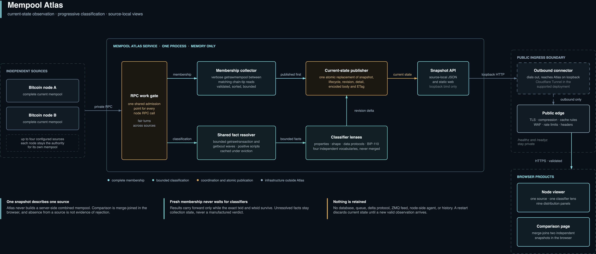

# Architecture

Mempool Atlas is a current-state viewer. It periodically observes independent
Bitcoin mempools, progressively classifies their current transactions through
independent lenses, and serves the newest successful observation for each
source.

The editable source is [`assets/architecture.drawio`](assets/architecture.drawio).

## System boundary

Atlas runs as one process with five responsibilities:

| Component               | Responsibility                                                                                          |
| ----------------------- | ------------------------------------------------------------------------------------------------------- |
| Membership collector    | Fetch and validate one complete mempool observation per source                                          |
| Shared fact resolver    | Resolve bounded raw transaction and prevout facts once per current generation                           |
| Classifier lenses       | Evaluate exact properties, heuristic shapes, data fingerprints, and BIP-110 compatibility independently |
| Current-state publisher | Atomically expose source snapshots, lifecycle, and transaction detail                                   |
| Web and API server      | Serve source-local data and the two browser products                                                    |

Each Bitcoin node remains an independent authority for its own mempool. Atlas
does not install software beside the node, combine source membership on the
server, or retain observations after they are replaced.

## Complete membership observations

For each configured source, `src/rpc.rs` performs this sequence:

1. Read the starting chain height and best block hash.
2. Read the reported mempool size and enforce the configured entry limit.
3. Fetch verbose `getrawmempool` membership, keeping each entry's reported
   weight, ancestry counts, virtual sizes, and delta-adjusted ancestor fees,
   and effective replaceability alongside its identity, virtual size, exact
   fee, and entry time.
4. Validate each `txid`, `wtxid`, virtual size, fee, and entry time.
5. Enforce the entry limit while decoding and sort entries by `txid`.
6. Read the ending chain height and best block hash.
7. Publish only if the starting and ending chain-tip reads match.

`getmempoolinfo` and `getrawmempool` are not one atomic read. Atlas compares
chain-tip reads before and after them and rejects the collection when they
differ. Matching reads bind the observation to that reported tip, but do not
freeze mempool changes or prove that the tip never changed between the two
reads. A failed poll leaves the previous successful snapshot visible and marks
it stale. Failure of one source does not prevent later sources in the same
round from being attempted.

Membership requests go through the shared bounded HTTP policy in
`src/rpc_transport.rs`: redirects are never followed, so the Basic credential
can only reach the configured origin; every request carries an explicit
timeout; and each response is read through a byte cap. Control reads use a
small fixed cap, while the verbose mempool cap is derived from the configured
entry limit, so a misbehaving endpoint cannot buffer arbitrarily more memory
than the configured mempool bound implies.

Every accepted observation records collection start, completion, and duration.
Age is derived relative to observation time, not the browser clock.

## Progressive transaction classification

Fresh membership is useful before every transaction has been enriched. Atlas
therefore publishes membership immediately, carrying forward only results
whose exact `txid` and `wtxid` survive from the prior generation.

`src/classification.rs` then advances the current generation through bounded
candidate and fact waves. Its presence-preserving JSON-RPC batching lives in
`src/classification_rpc.rs`, on the same shared `src/rpc_transport.rs` HTTP
policy that membership uses:

1. Fetch and verify raw candidate transactions with `getrawtransaction`.
2. Resolve unconfirmed parent outputs from current mempool transactions.
3. Resolve confirmed prevout scripts with `gettxout(txid, vout, false)`.
4. Evaluate a candidate only after every required script is present or has a
   genuine terminal result.
5. Run each independent classifier against the same bounded fact set.
6. Publish completed results in revisioned batches.

A verified candidate remains pending across fact-wave boundaries, so bounded
work does not repeatedly fetch the same transaction. Positive confirmed
scripts may be reused under bounded eviction. Nulls, failures, and departed
transactions are not cached as facts.

Collection state is kept separate from classifier evidence. Unscheduled work,
capacity deferral, transport errors, malformed responses, and absent JSON-RPC
members leave public classifier results unset. They do not manufacture a
negative match or indeterminate policy result. A present JSON `result: null` is
terminal only in the specific `gettxout` case where the outpoint is known not
to be a current mempool parent.

The classifier reports one of three public lifecycle states:

| State         | Meaning                                                            |
| ------------- | ------------------------------------------------------------------ |
| `classifying` | Eligible classification work remains for the current membership    |
| `complete`    | No eligible work remains, although some results may be unavailable |
| `paused`      | A systemic or internal failure stopped this generation             |

Membership health and classification lifecycle are independent. Replacement
membership supersedes stale classifier work, and results from an older
generation cannot update current state.

## Independent classifier lenses

`src/classifiers.rs` implements five versioned lenses over the
resolved fact set:

| Lens                     | Method                   | Question answered                                                       |
| ------------------------ | ------------------------ | ----------------------------------------------------------------------- |
| `transaction_properties` | Exact, multi-label       | Which serialized and script-family properties are present?              |
| `transaction_shape`      | Heuristic, multi-label   | Which explicitly defined transaction-shape patterns match?              |
| `data_protocols`         | Fingerprint, multi-label | Which supported data-carrier byte patterns are present?                 |
| `data_carriage_shape`    | Heuristic, multi-label   | Which high-confidence bulk-carrier witness shapes are present?          |
| `knots_bip110`           | Policy rule set          | How does this witness variant evaluate against deployed BIP-110 policy? |

The catalog, rules, thresholds, missing-fact behavior, and limitations are
defined in [`classification.md`](classification.md). Each lens versions its
own vocabulary and semantics. Atlas does not reconcile them into one taxonomy
or form cross-product categories. A transaction can legitimately match labels
from several lenses at once.

Compact snapshot entries carry label keys and completion state. Bounded
evidence is retained in transaction detail. A partial result preserves proven
labels while naming unavailable fact classes, so a missing label is never
presented as a reliable negative.

## Policy evaluator

`src/bip110/` is a private pure evaluator with no RPC, storage, async runtime,
or clock. Atlas uses its Bitcoin Knots mempool-policy mode for the seven
BIP-110 rules. The separate consensus mode, official vectors, and client-source
cross-checks remain test-only machinery in that module; the website does not
describe a policy violation as consensus invalidity. The public wire evaluator
identifier remains `rdts-rules`.

The BIP-110 assessment contains compatible, violating, or indeterminate status
plus typed evidence and missing-fact counts. A rule can have both a proven
violation and unresolved facts. Evidence is bounded to one exemplar of each
kind per rule. Its generic `knots_bip110` classifier result is a projection of
this specialist assessment, which remains available for rule-terrain
compatibility.

## Publication model

`src/runtime.rs` owns one in-memory runtime per source and one shared RPC work
gate. Membership rounds poll sources sequentially. Classification turns rotate
fairly between current source generations and release the gate between bounded
slices.

Classification work hands `src/runtime/publisher.rs` a strictly ordered
revision delta containing only changed transaction results. The publisher owns
the accumulated exact-result map and all reader-visible state. It materializes
and validates the complete snapshot, derives summaries, and encodes JSON after
the RPC gate has been released. Membership RPC can therefore proceed while a
classification revision is prepared. Generation and revision guards reject
superseded work at the atomic commit point.

One publication is prepared as a complete v2 bundle before the commit point.
The publisher encodes and validates the manifest, population, membership,
structure, catalog-ordered classifier stages, and matching detail map without
holding the reader lock. One atomic promotion then replaces:

- the source summary and source-scoped domain snapshot;
- its classification lifecycle and revision;
- its classifier catalog, coverage summaries, and compact transaction results;
- matching transaction-detail records; and
- the content-addressed stage map and manifest validator.

Readers therefore see one coherent publication. Failed preparation cannot
advance the domain snapshot or detail. A poll failure after a successful
publication produces a new manifest containing the stale source metadata while
retaining the exact prior stage buffers and content identifiers. Failure before
the first publication returns an exact non-cacheable `v2_unavailable` problem
response. Transaction detail is accepted by the browser only when source,
observation, transaction identity, witness identity, and assessment agree with
the visible publication.

Source discovery also publishes `atlas_version` from Rust's compiled
`CARGO_PKG_VERSION`. Both browser products render this server-authoritative
value in the shared header, so the visible version describes the running Atlas
process rather than an independently versioned static package.

Each manifest and stage receives a weak `ETag`. A manifest validator changes
when membership, classification, lifecycle, poll-start, or failure metadata
changes, and `Cache-Control: public, no-cache, must-revalidate` forces every
reuse through validation. A stage validator embeds its SHA-256 content
identifier and changes only with the exact body. Its content ID is also part of
the URL, which is never reused for different bytes, so successful stage
responses use `Cache-Control: public, max-age=31536000, immutable,
must-revalidate`. The one-year freshness lifetime removes redundant browser and
edge requests while `must-revalidate` resumes validator checks after expiry.

Atlas resolves a requested stage against the current publication before
evaluating `If-None-Match`. Explicit conditional reads of current
representations therefore still return `304` without a body, while a
well-formed content identifier absent from the current publication returns
non-cacheable `409`. An immutable cached stage represents only the exact bytes
named by its content ID, not evidence that a later manifest still declares it;
clients discover usable stage IDs only from the revalidated current manifest.
An identifier that belongs to a different current stage, or a request for a
stage kind or classifier that is not present, returns non-cacheable `404`.
Malformed identifiers or stage kinds return non-cacheable `400`, all before
conditional validation. Source discovery, transaction detail, failures, and
responses before the first publication remain non-cacheable. Clients that
advertise gzip support receive compressed JSON.

The process retains no application data on disk. Restarting discards current
state and readiness returns only after a new valid observation is available.

## Browser products

Both browser products first render the selected entries from the lightweight
`/api/v2/sources` response. Source label, availability, retained observation,
chain tip, membership totals, classification progress, and poll failure are
therefore visible before stage loading begins. The shared source
view keeps discovery, metadata, snapshot loading, derivation, and interactive
phases separate from ready, stale, waiting, and error availability.

A dedicated worker first fetches and validates the current manifest,
population, and selected classifier lane for the primary view. It then reads
the manifest again before completing membership, structure, and the remaining
catalog lanes behind that primary quorum. On a stable publication, the second
pass reuses the population and selected-classifier stages already held by the
worker. Stage digests,
dependency identifiers, row counts, and publication identity are checked before
the worker commits one internally coherent packed store. Superseded-stage `409`
responses trigger a bounded whole-publication retry; the browser never combines
stages from different manifests. Packed columns, bitsets, and first-seen result
dictionaries remain worker-owned, with presentation adapters exposing rows only
on demand rather than retaining the former full-row object graph.

The root browser entry redirects requests without node URL state to Compare.
Compare prefers the available Bitcoin Core and Bitcoin Knots sources for its
initial pair, while explicit `?source=...` state loads the single-node product.

The shared header presents Node and Compare as an equal-width primary view
switch on both products, with the active view explicit at every breakpoint.
The node viewer renders one source snapshot. Its default Classifications view
lets the user select one declared lens and combine its marginal labels with ANY
or ALL. Multi-label populations can overlap, but the resulting complete and
partial populations contain each matching transaction once. A dedicated query
view renders the full population as selectable Canvas blocks from compact
marginal row indexes. Proven labels in partial results remain queryable, while
unavailable results never match. Changing only the selected transaction
repaints its highlight without rescanning the snapshot. The browser does not
combine labels from different classifiers.

The Classifications inspector shows only the selected transaction's membership
facts and active-lens result. It does not repeat label controls, every classifier
as a cross-lens detail-card stack, or a sample-transaction table. The Buckets
inspector retains its independent marginal label and rule controls before the
population outcome they determine. `classification-overview-view.ts` owns the
lens selector, query controls, label cards, and semantics guidance;
`classification-query-view.ts` owns the query summary, Canvas listbox, hit
testing, keyboard traversal, resize lifecycle, and transaction highlight.
`main.ts` coordinates both with the remaining node-page views.

The selected classifier also drives the Buckets view, but Classifications query
labels and match mode remain independent of Buckets label and region emphasis.
Classifier lenses partition transactions by complete, partial, or unavailable
coverage and a lens-specific presentation adapter. Transaction properties uses
broad script-profile groups;
its exact labels remain marginal and transaction-level. Smaller generic lenses
retain exact observed label-set buckets. Every transaction belongs to exactly
one terrain region.

Below the viewer, a Snapshot distributions section derives nine aggregate
panels in the browser from the same published snapshot, one per question in
classification-first order: composition (one bar per catalog lens), fee
structure (a spectrum stacked by the selected classifier's buckets), ancestor
fee rate (delta-adjusted ancestor fees over ancestor virtual size), shape (a
joint fee-rate-by-size density heatmap with marginals), age (a bucket-by-age
mosaic), data carriage (OP_RETURN carried bytes by data-protocols bucket),
complexity (an input-count by output-count density), entanglement (banded
unconfirmed ancestor and descendant counts with the source-reported
replaceability share), and total output value (the sum of every output,
including change, by the selected classifier's buckets). Panels that need structure facts state
their coverage and skip transactions whose facts have not arrived. Multi-series
panels cap at the largest buckets and roll the remainder into one labelled
aggregate so every panel still covers the whole population. An aggregate-only
model builds all panels in one pass and is cached by snapshot identity and the
semantic classifier, metric, scope, and display limits. Revisited selections do
not rescan the transaction population, and the cache retains no transaction
arrays. Aggregation adds no per-transaction DOM nodes. Composition segments and
mosaic columns deep-link into the corresponding Buckets selection. An honesty
banner above the explore controls names the retained observation's age and poll
failure when a source is stale and reuses the paused-classification summary when
assessments are missing.

Every aggregate region participates in one section-local inspection surface.
Composition and mosaic regions expose their exact count, virtual size, and
share, while each spectrum or density chart remains one keyboard tab stop with
arrow-key bin traversal. Pointer movement hit-tests the existing SVG or Canvas
raster; clicking a plotted region pins its inspector until it is cleared or the
view owner changes. Inspection is presentation-only: it does not rebuild an
aggregate model, rescan transactions, alter filters, or add per-bin DOM nodes.
On desktop, a persisted presentation control lets the user keep the responsive
grid or explicitly arrange the nine panels in one, two, or three columns. The
single-column layout gives every chart the full content width. Narrow viewports
always retain one readable column regardless of the stored desktop preference.
The node distribution view delegates this presentation-only preference to
`snapshot-distribution-layout-control.ts`.
Axes derive positions from their raw logarithmic domains and preserve exact bin
bounds in the inspector. Joint densities visibly name both domains, and every
spectrum pairs its named logarithmic domain with a linear vertical scale for
the selected count or virtual-size metric. Data-carriage reference ticks mark 40 pushed bytes and
80 pushed bytes; the latter explains the conventional 83-byte serialized
script without representing 83 as a carried-byte bin boundary.

The node and comparison distribution sections each own their complete DOM,
cache, resize, rendering, and reset lifecycle behind a small view interface.
When a new model commits, each view synchronously retires the previous density
canvas and its inspection metadata before scheduling the replacement paint, so
old cells cannot remain visible or interactive beside new panel content.
The page entry points retain source loading, URL state, and coordination between
views rather than accumulating panel-specific implementation.

Selecting `knots_bip110` uses a specialist adapter over the same terrain engine.
Compatible, indeterminate, and unavailable assessments remain distinct.
Complete violations are grouped by their exact set of violated rules, while
partial violations retain separate proven-plus-unresolved sets. Rule controls
are marginal filters and the full seven-rule evidence remains available only in
this presentation. The cooperative classifier pass also builds compact row
indexes for all seven marginal rule populations. The terrain keeps one logical
glyph per transaction for hit testing, while two bounded per-layout canvas
rasters let rule changes compose dim and highlighted regions without replaying
every glyph. Changing the layout size, metric, or selection kind replaces that
raster pair. Selecting a transaction does not replace the active label, rule,
or bucket emphasis. It repaints the existing composition with one local glow,
while explicit region and filter controls remain the only interactions that
restyle the wider terrain. Marginal-label inspectors read count, virtual size,
and share directly from the compact row index, so selecting a dominant label
does not sort or materialize its transaction population. Fee rate by age
remains a secondary view.

The comparison page fetches two independent snapshots and merge-joins their
sorted `txid` arrays in the browser. It derives present-in-both and two
observed-only regions without creating a server-side comparison object. One
A difference between the reported tips promotes the comparison status and
timing panel to an amber warning. At equal height it names the chain divergence
directly; at different heights it preserves lag as an alternative explanation.
The shared region then describes cross-tip observation without predicting
confirmation.
Transaction detail exposes source-local base fee, virtual size, and base fee
rate so differing witness variants quantify their actual size and fee-rate
effect. Atlas applies the same BIP-110 evaluator to both source-local fact sets;
the UI never presents those results as verdicts reported by either node. One
policy projection pass builds per-node aggregate rows, including separate left
and right policy views for transactions common to both snapshots. Exact and
partial violation signatures remain separate, marginal rule counts may
overlap, and repeated filter selections reuse aggregate-only totals. The
prominent policy-focus toolbar owns those filters and makes their relationship
to the focused counts and highlighted overlap-map population explicit. An
explicit policy-focus change repaints the selected region, while selecting a
transaction reuses that focused base and adds only a local highlight. The
policy focus remains separate from the node-by-node distribution scope
selector. Mirrored distribution panels render each node's complete snapshot on
shared fixed axes using the same browser-derived builders as the node viewer
across all nine questions; the two populations are summarized independently
and never merged.
Panel-local controls select one classifier lens, the Count or vsize metric, and
the population used by every mirrored chart. Selecting an exact composition
segment changes that local lens and bucket, regrouping both sources without
changing the primary membership region or policy focus. The population scope
restricts every mirrored panel to the whole snapshot, the transactions present
in both snapshots, or the transactions observed in only one source, using the
same merge-join regions as the membership canvas. Each semantic combination of
source pair, lens, metric, and population has its own aggregate cache variant.
Each complete comparison candidate prepares the common scope and adopts only
its aggregate arrays into the candidate-owned cache; the smaller source-only
scopes remain lazy. A side with no members in the selected population says so
rather than showing an empty chart as data.

The membership regions and primary comparison workspace precede the secondary
distribution and policy panels in document order. Stable source-card,
snapshot-timing, transaction-lookup, workspace, and panel geometry prevents
later derivation from displacing the interactive comparison as those sections
populate. Snapshot timing remains in the source-pair panel. A separate
transaction panel groups txid lookup with the three merge-join membership
regions, so search and population selection share one explicit interaction
boundary beneath the context that defines the two observations.

The node page follows the same control hierarchy: its source selector, current
source facts, and txid lookup occupy one source panel below the product header.
Snapshot metadata is therefore part of the active node workspace rather than
the global header, while the underlying discovery and publication lifecycle
remains unchanged.

Both products keep source, classifier or policy selection, and optional
transaction state in the URL. The node URL also keeps the selected
Classifications label set and match mode. Repeated `label` parameters are
normalized against the selected catalog descriptor, and `match=all` is emitted
only when applicable. Snapshot and detail requests use generation guards so
obsolete responses cannot replace a newer source or pair selection.
On the comparison page, changing only the selected transaction reuses the
current population view. Keyboard movement commits each cursor position as the
current transaction, keeping the navigator, URL, detail, and canvas highlight
coherent while repainting only the active cell. Repeating the same interactive
selection is a true no-op, while a refreshed snapshot pair still reapplies
state and reloads detail against the new comparison identity. Node-state and
comparison-canvas coherence checks permit at most four candidate preparation
attempts; if live input or geometry keeps changing, the current committed
publication remains active instead of allowing an unbounded derivation loop.

## Network and credential boundary

Atlas accepts one to four source definitions and reads RPC passwords from
separate named files. Source configuration contains no password values. The
HTTP listener is restricted to loopback. Public traffic terminates at
Cloudflare, passes through a named Cloudflare Tunnel, and reaches Atlas only on
that loopback listener. Cloudflare owns public TLS, compression, cache rules,
WAF, request limits, and security headers. Operational health paths remain
private.

Bitcoin RPC credentials are not inherently read-only. The Atlas identity
should be restricted server-side to:

- `getblockchaininfo`
- `getmempoolinfo`
- `getrawmempool`
- `getrawtransaction`
- `gettxout`

Atlas does not require a database, message broker, ZMQ feed, node-side agent,
or an additional node listener.

The tunnel changes only public ingress. It does not schedule collection work:
Atlas continues to poll and classify every configured source regardless of
which source a browser is viewing.

## Design decisions

Only durable decisions that are not obvious from the code are retained:

- [ADR 0001: Keep only independent current snapshots](adr/0001-current-state-snapshots.md)
- [ADR 0002: Separate policy facts from collection state](adr/0002-policy-facts-and-collection-state.md)
- [ADR 0003: Derive comparison and terrain partitions in the browser](adr/0003-browser-derived-views.md)
