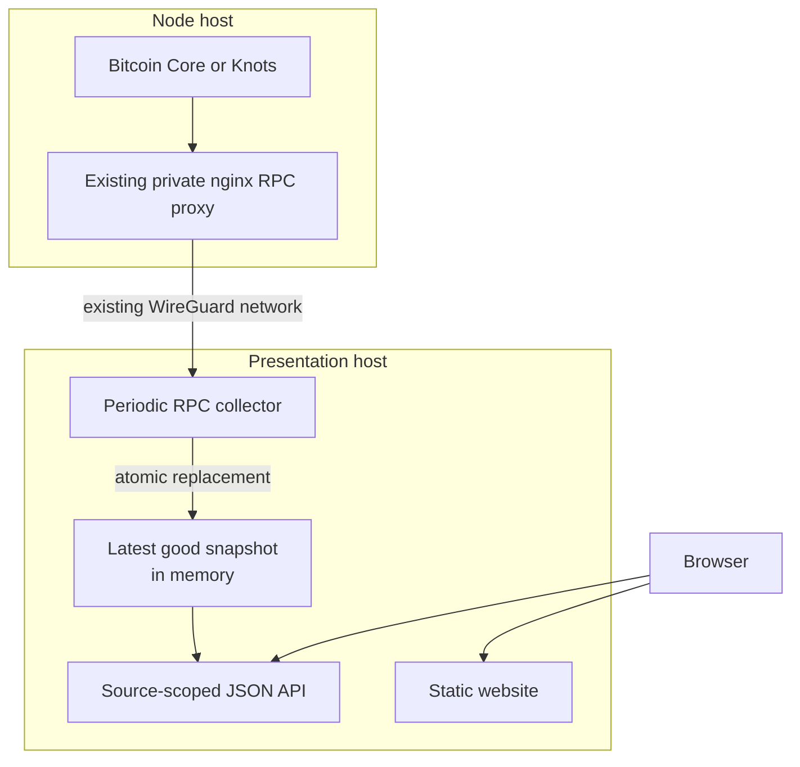

# Architecture

Mempool Atlas attempt #3 is one central process and one browser client. Its
scope is a complete current snapshot from one selected Bitcoin node.

## One process on the presentation host

`apps/atlas/` owns collection, current state, the API, and static file serving:

- `rpc.rs` calls `getmempoolinfo`, verbose `getrawmempool`, and
  `getblockchaininfo` through `corepc-client`.
- `model.rs` defines the complete flat snapshot contract.
- `runtime.rs` periodically builds a snapshot away from the reader-visible
  state, then replaces one `Arc<MempoolSnapshot>` after validation succeeds.
- `api.rs` exposes health, readiness, source discovery, current membership, and
  the built website.
- `main.rs` owns configuration, the loopback listener, credential-file loading,
  and graceful shutdown.

The initial executable configures exactly one source. `SourceRegistry` keeps the
read contract source-scoped so a later comparison product can add independent
sources without inventing a combined mempool.

## Snapshot contract

Each transaction contains only facts shared by supported Core and Knots verbose
RPC responses:

| Field | Meaning |
| --- | --- |
| `txid` | Current membership key |
| `vsize` | Transaction virtual size |
| `fee_sats` | Exact base fee in integer satoshis |
| `entered_at_ms` | Node-reported mempool entry time |

The snapshot also records source identity, completion time, block height, best
block hash, transaction count, and total virtual size. Transactions are
strictly sorted by txid. This makes equality, future merge-based comparison,
and payload validation straightforward.

Age is always calculated against `observed_at_ms`. Rendering against the
browser's current clock would make an immutable snapshot appear to change.

## Collection and failure

Before requesting the large verbose response, Atlas rejects a node-reported
mempool above `ATLAS_MAX_MEMPOOL_ENTRIES`. The custom deserializer enforces the
limit again because membership can change between the two RPC calls. It rejects
the complete poll if a required field is absent, malformed, inexact,
overflowing, or unsafe for JSON.

The next snapshot is fully decoded and validated before the runtime takes the
short write lock that replaces the current `Arc`. Readers therefore see the
previous complete snapshot or the next complete snapshot, never a partial one.
A failed poll records its error but preserves the last good snapshot as stale.
Before the first success, readiness remains false.

When availability changes, the runtime serializes the complete API response
once on a blocking worker and publishes its immutable `Bytes` beside the
structured snapshot. Each HTTP request clones that shared buffer rather than
allocating and serializing another large response. The presentation reverse
proxy remains responsible for compression, request rate limits, and concurrency
limits before public exposure.

Detailed RPC and validation errors remain in service logs. The public source
status uses a stable, sanitised message so a transport response cannot expose
private node details through the website.

`corepc-client` buffers the HTTP response before custom deserialization. During
replacement, the old structured snapshot and encoded response can also remain
alive while a reader finishes. The 200,000-entry cap is therefore an entry
bound, not a complete memory bound; deployment acceptance must observe real peak
memory.

Version 0.8 of `corepc-client` also fixes the JSON-RPC transport timeout at 15
seconds. A large real snapshot must be proven over the target WireGuard path
before deployment. If it cannot finish reliably inside that window, Atlas needs
a configurable transport rather than an incomplete snapshot.

## Network boundary

The service does not expose Bitcoin RPC publicly and does not introduce a new
transport. Deployment supplies the existing WireGuard-only node RPC proxy URL
and a dedicated least-privilege RPC credential. Authentication alone is not an
authorization boundary: the node must whitelist that identity to exactly
`getmempoolinfo`, `getrawmempool`, and `getblockchaininfo`. The proxy must stream
large responses without proxy-temp spill and use a timeout compatible with the
validated collection window. Atlas itself binds only to loopback behind the
existing website proxy.

Hostnames, private addresses, credentials, and fleet inventory belong to the
deployment repository, not this application repository.

## Browser boundary

`web/` is a dependency-light Vite application. It discovers the configured
source, fetches one complete snapshot, validates it, and renders:

- a health and freshness summary;
- aggregate count and virtual size;
- a Canvas fee-by-age swim view;
- client-side filters;
- a paginated txid inspector.

The UI performs no automatic full-snapshot polling. Manual refresh fetches the
current server copy and does not initiate node collection.

The service defaults to a five-minute collection delay. Production cadence is
an operational capacity choice based on measured response bytes, transfer time,
node work, and required freshness, not a live-data promise.

## Products kept separate

The viewer stores no history. Forensic archives, peer-observer events,
rejections, classifiers, and other evidence have different lifecycle and
capacity needs and must remain a separate system.

Multi-node comparison is also a separate product surface. It may reuse the
snapshot model and collection code, but each source remains independent and
comparison is derived from complete snapshots. Absence from a source is not
evidence of rejection, filtering, or relay causality.
