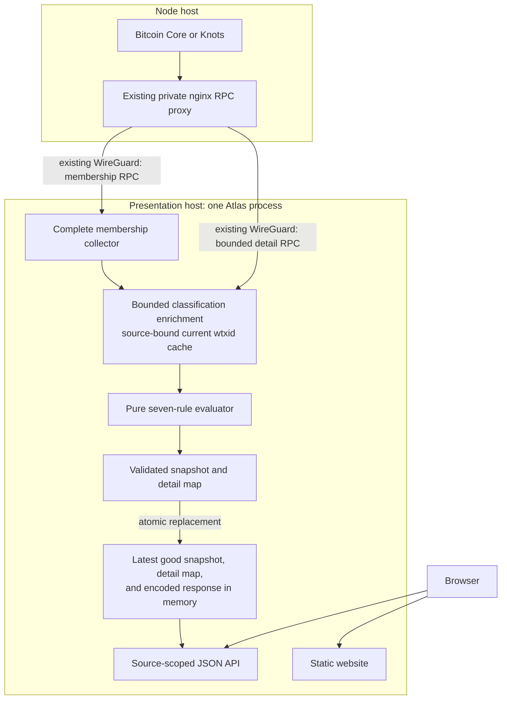

# Architecture

Mempool Atlas attempt #3 is one central process on the presentation host and
one browser client. Its scope is the current mempool of one selected Bitcoin
node, including a bounded classification of current witness variants against
the seven BIP-110 rules as deployed Bitcoin Knots mempool policy.

## One process on the presentation host

`apps/atlas/` owns collection, current state, the API, and static file serving:

- `rpc.rs` collects complete membership with `getmempoolinfo`, verbose
  `getrawmempool`, and `getblockchaininfo` through `corepc-client`.
- `policy.rs` enriches a bounded set of current witness variants through
  batched `getrawtransaction` and `gettxout(txid, vout, false)` calls.
- `model.rs` defines the complete flat snapshot, compact classification, and
  typed transaction-detail contracts.
- `runtime.rs` periodically builds an observation away from reader-visible
  state, then atomically replaces the snapshot and matching detail map after
  validation succeeds.
- `api.rs` exposes health, readiness, source discovery, current membership,
  current transaction detail, and the built website.
- `main.rs` owns configuration, the loopback listener, credential-file loading,
  and graceful shutdown.

`crates/rdts-rules/` is a pure evaluator. It has no I/O, async state, chain
access, or clock. It exposes separate consensus and mempool-policy modes. Atlas
uses only the mempool-policy mode, which applies all seven rules without a
deployment activation gate or UTXO grandfathering.

The initial executable configures exactly one source. `SourceRegistry` keeps the
read contract source-scoped so a later comparison product can add independent
sources without inventing a combined mempool.

## Snapshot contract

Each transaction contains current membership facts plus a compact optional
classification:

| Field | Meaning |
| --- | --- |
| `txid` | Current membership key |
| `wtxid` | Current witness variant reported by the source |
| `vsize` | Transaction virtual size |
| `fee_sats` | Exact base fee in integer satoshis |
| `entered_at_ms` | Node-reported mempool entry time |
| `bip110` | Compatible, violating, indeterminate, or `null` when not yet classified |

The snapshot also records source identity, membership observation time, block
height, best block hash, transaction count, total virtual size, evaluator
identity, policy scope, and the four classification totals. Transactions are
strictly sorted by txid. This makes equality, future merge-based comparison,
and payload validation straightforward.

The compact assessment identifies all proven violated rules, all rules with
missing facts, and the deterministic first rejection when it can be known. A
transaction can have a proven rule violation while another input for that same
rule remains unresolved. In that case the rule appears in both lists. Missing
facts before a proven later rejection can also leave `primary_rule` unset even
though the transaction status is `violating`.

Age is always calculated against `observed_at_ms`. Rendering against the
browser's current clock would make an immutable snapshot appear to change.

## Classification meaning

The production classification is compatibility with the RDTS/BIP-110 rules
enforced as standard mempool policy by the deployed Bitcoin Knots client. It is
not proof that the observed source rejected a transaction, and it is not a
claim that a transaction is consensus-invalid. The evaluator reports these
seven exact rule categories:

| Rule | Public ID | Check |
| --- | --- | --- |
| 1 | `output_size` | Output script size |
| 2 | `element_size` | Serialized script or witness element size |
| 3 | `undefined_version` | Undefined witness or Tapleaf version |
| 4 | `taproot_annex` | Taproot annex presence |
| 5 | `control_block_size` | Taproot control-block size |
| 6 | `op_success` | `OP_SUCCESS` in Tapscript |
| 7 | `tapscript_op_if` | Executed `OP_IF` or `OP_NOTIF` in Tapscript |

Every classified transaction has one typed outcome per rule. A definite match
contains evidence such as byte lengths, input or output positions, opcodes, and
limits. Missing prevout scripts and evaluator limitations become typed missing
facts rather than guesses.

Atlas retains the exact evidence and missing-fact counts for each rule, but
only one evidence exemplar and one missing-fact exemplar. This bounds the
reader-visible detail retained for one transaction. The full evaluator result
exists only while the current transaction is being reduced to this compact
form.

## Collection and enrichment

Every poll first establishes complete membership:

1. `getmempoolinfo` preflights the reported entry count.
2. `getrawmempool true` returns the complete current membership, including
   `txid`, `wtxid`, `vsize`, entry time, and base fee.
3. `getblockchaininfo` binds the observation to the source chain tip.

Before requesting the large verbose response, Atlas rejects a node-reported
mempool above `ATLAS_MAX_MEMPOOL_ENTRIES`. The custom deserializer enforces the
limit again because membership can change between the two RPC calls. It rejects
the complete poll if a required membership field is absent, malformed,
inexact, overflowing, or unsafe for JSON.

Classification is then best effort and bounded:

1. Prune the source-bound cache to `wtxid` variants still present with the same
   `txid`, and attach cached assessments.
2. Resume after a source-local round-robin cursor, wrap through sorted
   membership, and select at most `ATLAS_MAX_CLASSIFICATIONS_PER_POLL` uncached
   or incomplete variants, 10,000 by default. Advancing the cursor prevents
   persistent partial results at low txids from starving later members.
3. Fetch and verify raw transactions in batches of 16. Unconfirmed parent
   transactions use the same batch size; confirmed prevout scripts use
   `gettxout(txid, vout, false)` in batches of 128.
4. Evaluate every raw transaction for which bytes were available. Missing
   prevouts yield typed unknowns, so output-scoped violations and any other
   decidable rules remain visible.
5. Cache complete results and retryable partial results by current `wtxid`.

A missing or invalid raw transaction response leaves that membership entry
unclassified. An incomplete prevout set produces a visible partial
classification and remains eligible for retry on the next poll. Neither case
invalidates fresh membership.

The default classification budget is 45 seconds, checked before starting more
work. It is a soft start budget: a batch already in flight may complete after
the deadline. Classification batches use a 20-second transport timeout.

## Publication and failure

The next membership snapshot and detail map are built and cross-validated
before publication. The runtime also serializes the complete snapshot response
on a blocking worker. It then replaces the structured snapshot, matching
detail map, and shared encoded response under one short write lock. Readers
therefore see the previous complete observation or the next complete
observation, never membership from one poll with details from another.

A failed membership poll records its error but preserves the last good
observation as stale. Before the first success, readiness remains false. Batch
or response failures during best-effort classification are logged and produce
partial coverage, not a stale membership snapshot.

Each current-snapshot HTTP request clones the immutable shared response buffer
rather than allocating and serializing another large body. The presentation
reverse proxy remains responsible for compression, request rate limits, and
concurrency limits before public exposure.

Detailed RPC and validation errors remain in service logs. The public source
status uses a stable, sanitised message so a transport response cannot expose
private node details through the website.

`corepc-client` buffers the HTTP response before custom deserialization. During
replacement, the old structured snapshot and encoded response can also remain
alive while a reader finishes. The 200,000-entry cap is therefore an entry
bound, not a complete memory bound. The current classification cache and detail
map add bounded-per-entry state, so deployment acceptance must still observe
real peak memory.

Version 0.8 of `corepc-client` also fixes the JSON-RPC transport timeout at 15
seconds for the complete membership path. The first membership-only deployment
accepted complete 28,520 to 33,381 entry snapshots over the target WireGuard
path in 6.9 to 15.4 seconds end-to-end and peaked below 49 MB after a full
browser load. Those measurements do not include the classification cache or
detail map and are not a 200,000-entry proof. Materially larger mempools and the
classified deployment require renewed measurement.

## Network boundary

The service does not expose Bitcoin RPC publicly and does not introduce a new
node-side service, container, queue, database, listener, or transport.
Deployment supplies the existing WireGuard-only node RPC proxy URL and a
dedicated least-privilege RPC credential. Authentication alone is not an
authorization boundary: the node must whitelist that identity to exactly
`getmempoolinfo`, `getrawmempool`, `getblockchaininfo`, `getrawtransaction`,
and `gettxout`. The proxy must stream large responses without proxy-temp spill
and use timeouts compatible with the validated collection windows. Atlas
itself binds only to loopback behind the existing website proxy.

Hostnames, private addresses, credentials, and fleet inventory belong to the
deployment repository, not this application repository.

## Read API

`GET /api/v1/sources` returns source availability and small snapshot metadata.
`GET /api/v1/sources/{source_id}/mempool` returns that status plus the latest
complete snapshot, or `null` before the first successful poll.

`GET /api/v1/sources/{source_id}/transactions/{txid}` reads the detail map bound
to the current snapshot. It returns:

- `200` with current `txid`, `wtxid`, compact assessment, seven rule outcomes,
  exact counts, and bounded exemplars when classified;
- `400` for a malformed transaction ID;
- `404` for an unknown source or a transaction absent from current membership;
- `503` while no snapshot exists or when the present transaction has no
  classification yet.

All API responses use `Cache-Control: no-store`.

## Browser boundary

`web/` is a dependency-light Vite application. It discovers the configured
source, fetches one complete snapshot, validates it, and renders:

- a health and freshness summary;
- a primary Canvas classification terrain with compatible, indeterminate,
  unclassified, unresolved-primary, and seven exact rule territories;
- count and virtual-size transaction-tile modes;
- rule navigation, representative transactions, and on-demand typed detail;
- a fee-rate-by-age Canvas as a secondary lens with client-side filters.

The UI performs no automatic full-snapshot polling. Manual refresh fetches the
current server copy and does not initiate node collection.

The service defaults to a five-minute collection delay. Production cadence is
an operational capacity choice based on measured response bytes, transfer time,
node work, and required freshness, not a live-data promise.

## Products kept separate

The viewer stores no history. Its rule detail describes only the current
snapshot and is discarded when membership changes. Forensic archives,
peer-observer events, rejection observations, and other retained evidence have
different lifecycle and capacity needs and must remain a separate system.

Multi-node comparison is also a separate product surface. It may reuse the
snapshot model and collection code, but each source remains independent and
comparison is derived from complete snapshots. Absence from a source is not
evidence of rejection, filtering, or relay causality.
