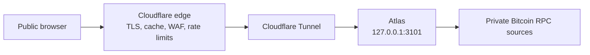

# Deploy behind Cloudflare

Mempool Atlas is a persistent origin service, not a Cloudflare Worker or Pages
application. Run Atlas beside `cloudflared` on the presentation host and expose
only the tunnel hostname.



Browser traffic never initiates Bitcoin RPC. Atlas continuously polls and
classifies every configured source even when nobody is viewing it.

## Deployment inputs

Record these values in the private deployment system before installation:

- the Cloudflare zone and public hostname;
- the Cloudflare plan and features available to that zone;
- the tunnel UUID and credential location;
- the presentation-host paths and service account;
- the private RPC source inventory and credentials; and
- launch budgets for memory, poll duration, classification lag, response size,
  origin request rate, and outbound traffic.

Do not commit those values to this repository.

## Build the origin

Build and verify the release from a clean, reviewed revision:

```bash
npm --prefix web ci
just lint
just test
VITE_UMAMI_SCRIPT_URL=https://analytics.example.com/script.js \
VITE_UMAMI_WEBSITE_ID=00000000-0000-4000-8000-000000000000 \
VITE_UMAMI_DOMAINS=atlas.example.com \
  just build
cargo build --release --locked
```

Omit the three `VITE_UMAMI_*` variables when analytics is not required. If the
tracker uses a separate origin, add that exact HTTPS origin to `script-src` and
`connect-src` in the edge Content Security Policy. A first-party reverse proxy
can keep both directives at `'self'` instead.

Install the release binary and `web/dist` under `/opt/mempool-atlas`. Create a
dedicated `mempool-atlas` system account with no interactive shell. Copy
[`deploy/systemd/mempool-atlas.service.example`](../deploy/systemd/mempool-atlas.service.example)
to the host's systemd unit directory and review every path before enabling it.

Copy [`deploy/systemd/atlas.env.example`](../deploy/systemd/atlas.env.example)
to `/etc/mempool-atlas/atlas.env`. The environment file contains paths and
limits, not passwords. Store `sources.json` and the named password files under
`/etc/mempool-atlas`, owned by root and readable only by the Atlas service
group. Keep the source file, environment file, and password files out of Git.

The example unit deliberately leaves `MemoryHigh` and `MemoryMax` unset. Add
host-specific values only after measuring representative one, two, and
four-source workloads. An unverified memory ceiling can terminate Atlas during
a valid large snapshot and is not a substitute for the application bounds.

Verify the installed unit:

```bash
sudo systemd-analyze verify /etc/systemd/system/mempool-atlas.service
sudo systemctl enable --now mempool-atlas.service
curl --fail --silent http://127.0.0.1:3101/healthz
curl --fail --silent http://127.0.0.1:3101/api/v2/sources
```

`/readyz` becomes ready after any configured source has published a valid
snapshot. Monitor `/api/v2/sources` locally when every source must be checked.
The response's `atlas_version` must match the release being installed, and the
same value appears beside the Mempool Atlas name on both browser pages.

## Create the tunnel

Install `cloudflared` from Cloudflare's supported packages. Create a named
tunnel and public hostname, then copy
[`deploy/cloudflare/cloudflared-config.yml.example`](../deploy/cloudflare/cloudflared-config.yml.example)
to `/etc/cloudflared/config.yml` on the origin host.

Replace the tunnel UUID and hostname locally. The two operational health paths
are matched before the public application route and return `404`. The final
catch-all rule is mandatory and prevents an unmatched hostname from reaching
Atlas.

Validate and start the tunnel:

```bash
cloudflared tunnel ingress validate
cloudflared tunnel ingress rule https://atlas.example.com/
cloudflared tunnel ingress rule https://atlas.example.com/healthz
sudo systemctl enable --now cloudflared.service
```

Cloudflare documents the current locally managed configuration and validation
commands in its
[Tunnel configuration reference](https://developers.cloudflare.com/tunnel/advanced/local-management/configuration-file/).

The origin firewall should expose no Atlas port. `cloudflared` makes outbound
connections to Cloudflare and reaches Atlas over loopback. Confirm that neither
the host address nor any unproxied DNS record can reach port 3101.

## Configure cache behavior

Cloudflare does not cache HTML or JSON by default. Create explicit Cache Rules
for the public hostname and keep them narrow. Rule ordering matters because the
last matching rule wins.

| Route | Eligibility | Browser behavior | Edge behavior |
| --- | --- | --- | --- |
| `/assets/*` | Eligible | Long-lived and immutable | Long-lived |
| `/` and `/compare/` | Bypass | Revalidate | Bypass |
| `/api/v2/sources/*/mempool` | Eligible for `GET` and `HEAD` | Revalidate | Respect origin validators |
| `/api/v2/sources/*/mempool/stages/*` | Eligible for `GET` and `HEAD` | One year, immutable | One year; respect origin |
| `/api/v2/sources` | Bypass | `no-store` | Bypass |
| `/api/v2/sources/*/transactions/*` | Bypass | `no-store` | Bypass |
| errors and operational paths | Bypass | `no-store` | Bypass |

Atlas does not send `Cache-Control` for static documents or assets; the
browser and edge behavior for those two rows comes entirely from these Cache
Rules. Every API, operational, and error response carries an explicit origin
`Cache-Control` header.

For the manifest and stage rules:

1. Match only the Atlas hostname, `GET` or `HEAD`, and the exact source snapshot
   manifest or content-addressed stage path shapes.
2. Mark JSON eligible for cache.
3. Respect the origin `Cache-Control` and `ETag` headers. Do not set an Edge
   Cache TTL or Browser Cache TTL that overrides them.
4. Match only an empty query string. Requests with a non-empty query string
   must bypass the edge cache and reach Atlas, which rejects them as
   non-cacheable `400` responses. A bare trailing `?` can still satisfy an
   edge empty-query match and be forwarded, but Atlas rejects that request as
   a non-cacheable `400` too.
5. Do not enable stale serving for the API. Manifests must always revalidate;
   stages have their own explicit freshness lifetime and must revalidate after
   it expires. Atlas already publishes explicit source failure and staleness
   state.

Atlas returns `Cache-Control: public, no-cache, must-revalidate` and a weak
`ETag` for the current manifest. Never assign the manifest a freshness TTL: it
is the authority that declares the current stage IDs and must revalidate on
every reuse.

A successful current stage returns `Cache-Control: public,
max-age=31536000, immutable, must-revalidate` and a weak `ETag`. The content ID
in its URL is the SHA-256 digest of the exact body, so that URL is never reused
for different bytes. One year follows the established immutable-asset
convention; `must-revalidate` requires validation again after that freshness
lifetime. Cloudflare documents that `immutable` affects browsers rather than
public-cache freshness, while `max-age` supplies the edge and browser lifetime
when Origin Cache Control is respected.

Atlas checks current stage membership before evaluating a conditional header,
so an explicit matching `If-None-Match` request for a current representation
still returns `304` without the JSON body. A cached immutable stage represents
only the bytes named by its content ID, not evidence that a later manifest
still declares it. Clients must use stage IDs from the freshly revalidated
manifest.

A well-formed content identifier absent from the current publication returns
non-cacheable `409`. An identifier that belongs to a different current stage,
or a request for a stage kind or classifier that is not present, returns
non-cacheable `404`. A malformed identifier or stage kind returns non-cacheable
`400`, all before validator handling. Cache eligibility must not override those
`no-store` error responses. Before the first publication, the manifest and
stage routes return non-cacheable `503 application/problem+json` with no
validator.

Review Cloudflare's current
[default cache behavior](https://developers.cloudflare.com/cache/concepts/default-cache-behavior/),
[Cache Rule settings](https://developers.cloudflare.com/cache/how-to/cache-rules/settings/),
and [Origin Cache Control](https://developers.cloudflare.com/cache/concepts/cache-control/)
when creating the rules. Availability and minimum TTL behavior vary by plan.
Do not override the manifest with a fixed TTL or replace the stage lifetime
with an edge-only value merely to obtain a cache hit.

## Configure edge security

Enable the Cloudflare managed WAF rules available to the zone. Add a method rule
that permits only `GET` and `HEAD` for the public Atlas hostname.

Use the rate-limit rule capacity available to the zone plan. When the account
has only one shared rule, add an Atlas hostname arm to that rule rather than
prescribing unavailable per-route rules. The production arm matches
`atlas.example.com` with paths beginning `/api/v2/`, allows 50 requests per
IP per 10 seconds, and blocks for 10 seconds when exceeded.

A stable cold node publication load makes two manifest reads and seven stage
reads, for nine staged-publication requests. The first manifest plus the
population and selected-classifier stages make the primary view interactive;
the second manifest precedes the complete seven-stage publication, with the two
already loaded stages reused in the browser. A stable cold comparison performs
that flow for both sources concurrently: four manifest reads and fourteen stage
reads, for eighteen staged-publication requests. Source discovery is one
additional request per page load, and opening transaction detail adds another.

Treat those counts as the no-retry floor, not as the rate-limit threshold.
Every `429` request can be retried up to three times after its initial attempt,
and a superseded `409` can restart a whole-publication load up to three times;
unchanged content-addressed stages are reused where possible. The documented
50-request window admits a stable comparison with headroom, but five
simultaneous cold node loads consume 45 staged requests plus five
source-discovery requests before any detail, retry, or supersession. Choose the
production threshold from observed cold-burst traffic and origin capacity, and
do not count client retries as spare capacity. If the zone plan permits
additional rate-limit rules, use those rules to apply stronger limits to the
population and membership stages because they carry the largest bandwidth and
slow-reader cost. On a plan limited to one shared rule, keep those stages under
the hostname-wide rule described above.

Validate the rule in staging before enabling a blocking action. Cloudflare's
[rate-limiting documentation](https://developers.cloudflare.com/waf/rate-limiting-rules/)
describes the fields and actions available to each plan.

Add these response headers at the edge:

```text
Content-Security-Policy: default-src 'self'; base-uri 'none'; connect-src 'self' https://analytics.example.com; form-action 'self'; frame-ancestors 'none'; img-src 'self' data:; object-src 'none'; script-src 'self' https://analytics.example.com; style-src 'self'; worker-src 'self'
Cross-Origin-Opener-Policy: same-origin
Permissions-Policy: camera=(), geolocation=(), microphone=()
Referrer-Policy: no-referrer
X-Content-Type-Options: nosniff
```

Enable HSTS after confirming that the selected hostname and any included
subdomains are HTTPS-only. Do not add `includeSubDomains` without checking the
whole parent domain.

Enable compression and verify that full JSON responses have a supported
`Content-Encoding`. Cloudflare lists `application/json` among its compressible
content types in the
[compression reference](https://developers.cloudflare.com/speed/optimization/content/compression/).

## Capacity and monitoring

The configured classification cache is a service-wide budget divided among
sources. Domain snapshots, classification detail maps, encoded v2 bundles, RPC
buffers, allocator overhead, and response buffers retained by slow readers are
outside that budget.

Atlas logs `publication_id`, `encoded_bytes`, and `classification_revision`
whenever it promotes a publication. Combine those fields with the existing
poll-round and classification logs. Monitor:

- resident and peak memory;
- full poll-round and per-source collection duration;
- observation skew between configured sources;
- classification state, remaining work, and pauses;
- encoded publication size by source and revision;
- Cloudflare cache status and origin request rate;
- response bandwidth and compression ratio;
- rate-limit and WAF actions; and
- tunnel and Atlas service restarts.

Exercise one, two, and four sources with representative mempool sizes before
raising the deployed source count. Keep the hard maximum at four until all
launch budgets pass under the intended host and Cloudflare plan.

## Public smoke test

Run the smoke test only after at least one source has a ready snapshot and the
Cloudflare rules are active. The host running it must provide `awk`, `cp`,
`curl`, `grep`, `head`, `jq`, `mktemp`, `openssl`, `rm`, and `xxd` on `PATH`:

```bash
just smoke-public https://atlas.example.com node-a
```

It verifies the source discovery status, cache policy, and required semantic
Atlas version, plus hidden public health paths, Cloudflare routing,
compression, the always-revalidated manifest, every immutable declared stage,
manifest and stage validators, transaction detail when the publication is
non-empty, and conditional `304` behavior.
Rate-limit actions and direct-origin
isolation require separate staging and firewall checks.

## Release deployment

The application package exposes `/api/v2` as its single public API contract.
The edge configuration must contain no Atlas route, redirect, transform, cache
rule, or rate-limit arm for any other API version.

The deadmanoz production release is formalized in the private
[`deadmanoz/mempool-atlas-deploy`](https://github.com/deadmanoz/mempool-atlas-deploy)
repository. Its `mempool-atlas-src` flake input pins one reviewed application
revision. The `packages.x86_64-linux.production` output builds the server and
browser from that same input, and `nixosModules.viewer` injects the combined
package into the Atlas service. The separate `nixos-config-deadmanoz` fleet
flake pins the `mempool-atlas-deploy` input and remains the only authority that
switches hosts. Production releases therefore switch one Nix store package;
they do not copy or replace the server and browser artifacts separately under
`/opt`.

1. Push the reviewed application revision. In `mempool-atlas-deploy`, update
   and verify the application pin, then build the production package:

   ```bash
   just update-app       # nix flake update mempool-atlas-src
   just verify-app-pin
   just check
   just test
   just build
   ```

   Commit and push the resulting deploy-repository `flake.lock` only after all
   five commands pass.

2. In `nixos-config-deadmanoz`, update only its `mempool-atlas-deploy` flake
   input to that reviewed deploy revision. Use the fleet repository's build
   commands to evaluate all hosts and build the presentation and source hosts
   before switching any of them. The deploy repository deliberately provides
   the package and modules, not a host-switch command.
3. From `mempool-atlas-deploy`, run `just verify-cloudflare`, then add a
   temporary fail-closed edge rule for the Atlas hostname. Preflight the v2
   always-revalidated manifest rule, one-year immutable stage rule, no-stale
   behavior, CSP worker allowance, method rule, WAF policy, and rate limits
   while the block remains active.
4. Switch source hosts first only if their evaluated RPC configuration changes.
   Switch the presentation host last; that NixOS switch changes the service
   executable and `ATLAS_WEB_ROOT` to paths in the same production package.
5. Verify loopback discovery, manifest, every declared stage, detail, and
   validators. Purge the public `/api/v2` cache namespace, then remove the
   temporary edge block.
6. In `mempool-atlas-deploy`, run:

   ```bash
   just verify-live vps-knots-01-knots
   ```

   From this application repository, run `just smoke-public`, ten cold
   sequential node loads, five cold concurrent node loads, and the worst-case
   comparison load through the public hostname.

The deploy repository's
[`production-deployment.md`](https://github.com/deadmanoz/mempool-atlas-deploy/blob/main/agent_docs/production-deployment.md)
is the operator source of truth for the exact host sequence and acceptance
checks.

The edge and Nix control planes cannot change atomically. The temporary block
makes the gap fail closed instead of serving mixed generations.

Rollback is limited to another reviewed v2 revision with the same edge
contract. First restore the temporary edge block. In `nixos-config-deadmanoz`,
pin the `mempool-atlas-deploy` input to the selected reviewed deploy revision;
that revision's `flake.lock` selects the matching `mempool-atlas-src` revision,
package, and Atlas modules. Build before switching, switch only affected source
hosts, and switch the presentation host last. That switch restores the server
executable and browser root together from the selected production package, so
there is no manual artifact restore under `/opt`.

Restore the matching Cloudflare cache and security rules, purge the
`atlas.example.com/api/v2` prefix, and verify the loopback v2 API. Only then
remove the edge block and rerun `just verify-live` from
`mempool-atlas-deploy` plus `just smoke-public` from this repository. A Nix
rollback does not revert Cloudflare state by itself.

## Failure and rollback checks

Before launch, exercise these cases:

1. Restart Atlas and confirm the public API does not cache the exact
   `v2_unavailable` response before first publication.
2. Stop one Bitcoin RPC source and confirm the retained publication gets a new
   stale manifest while its declared content-addressed stages remain unchanged
   and other sources continue.
3. Restart `cloudflared` and confirm it reconnects without exposing the origin.
4. Purge a superseded stage URL, request it with its old matching validator,
   and confirm the origin currentness check returns non-cacheable `409` rather
   than `304`. Purging prevents a still-fresh immutable edge entry from
   satisfying this origin-specific check.
5. Send an old manifest ETag after a classification update and confirm the
   response is `200` with the new manifest.
6. Send current manifest and stage ETags explicitly and confirm `304` with no
   body and the route-appropriate cache policy.
7. Run controlled concurrent stage reads and confirm polling and
   classification remain within the recorded budgets.

To remove public access, disable the tunnel hostname or its DNS route first.
Then stop the origin service if required. Atlas retains no application state on
disk, so a restart always requires fresh source observations.
