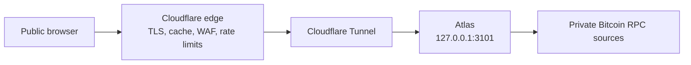

# Deploy behind Cloudflare

Mempool Atlas is a persistent origin service, not a Cloudflare Worker or Pages
application. Run Atlas beside `cloudflared` on the presentation host and expose
only the tunnel hostname.



Browser traffic never initiates Bitcoin RPC. Atlas continuously polls and
classifies every configured source even when nobody is viewing it.

## Deployment inputs

Record these values in the private deployment system before installation:

- the Cloudflare zone and public hostname;
- the Cloudflare plan and features available to that zone;
- the tunnel UUID and credential location;
- the presentation-host paths and service account;
- the private RPC source inventory and credentials; and
- launch budgets for memory, poll duration, classification lag, response size,
  origin request rate, and outbound traffic.

Do not commit those values to this repository.

## Build the origin

Build and verify the release from a clean, reviewed revision:

```bash
npm --prefix web ci
just lint
just test
VITE_UMAMI_SCRIPT_URL=https://analytics.example.com/script.js \
VITE_UMAMI_WEBSITE_ID=00000000-0000-4000-8000-000000000000 \
VITE_UMAMI_DOMAINS=atlas.example.com \
  just build
cargo build --release --locked
```

Omit the three `VITE_UMAMI_*` variables when analytics is not required. If the
tracker uses a separate origin, add that exact HTTPS origin to `script-src` and
`connect-src` in the edge Content Security Policy. A first-party reverse proxy
can keep both directives at `'self'` instead.

Install the release binary and `web/dist` under `/opt/mempool-atlas`. Create a
dedicated `mempool-atlas` system account with no interactive shell. Copy
[`deploy/systemd/mempool-atlas.service.example`](../deploy/systemd/mempool-atlas.service.example)
to the host's systemd unit directory and review every path before enabling it.

Copy [`deploy/systemd/atlas.env.example`](../deploy/systemd/atlas.env.example)
to `/etc/mempool-atlas/atlas.env`. The environment file contains paths and
limits, not passwords. Store `sources.json` and the named password files under
`/etc/mempool-atlas`, owned by root and readable only by the Atlas service
group. Keep the source file, environment file, and password files out of Git.

The example unit deliberately leaves `MemoryHigh` and `MemoryMax` unset. Add
host-specific values only after measuring representative one, two, and
four-source workloads. An unverified memory ceiling can terminate Atlas during
a valid large snapshot and is not a substitute for the application bounds.

Verify the installed unit:

```bash
sudo systemd-analyze verify /etc/systemd/system/mempool-atlas.service
sudo systemctl enable --now mempool-atlas.service
curl --fail --silent http://127.0.0.1:3101/healthz
curl --fail --silent http://127.0.0.1:3101/api/v1/sources
```

`/readyz` becomes ready after any configured source has published a valid
snapshot. Monitor `/api/v1/sources` locally when every source must be checked.
The response's `atlas_version` must match the release being installed, and the
same value appears beside the Mempool Atlas name on both browser pages.

## Create the tunnel

Install `cloudflared` from Cloudflare's supported packages. Create a named
tunnel and public hostname, then copy
[`deploy/cloudflare/cloudflared-config.yml.example`](../deploy/cloudflare/cloudflared-config.yml.example)
to `/etc/cloudflared/config.yml` on the origin host.

Replace the tunnel UUID and hostname locally. The two operational health paths
are matched before the public application route and return `404`. The final
catch-all rule is mandatory and prevents an unmatched hostname from reaching
Atlas.

Validate and start the tunnel:

```bash
cloudflared tunnel ingress validate
cloudflared tunnel ingress rule https://atlas.example.com/
cloudflared tunnel ingress rule https://atlas.example.com/healthz
sudo systemctl enable --now cloudflared.service
```

Cloudflare documents the current locally managed configuration and validation
commands in its
[Tunnel configuration reference](https://developers.cloudflare.com/tunnel/advanced/local-management/configuration-file/).

The origin firewall should expose no Atlas port. `cloudflared` makes outbound
connections to Cloudflare and reaches Atlas over loopback. Confirm that neither
the host address nor any unproxied DNS record can reach port 3101.

## Configure cache behavior

Cloudflare does not cache HTML or JSON by default. Create explicit Cache Rules
for the public hostname and keep them narrow. Rule ordering matters because the
last matching rule wins.

| Route | Eligibility | Browser behavior | Edge behavior |
| --- | --- | --- | --- |
| `/assets/*` | Eligible | Long-lived and immutable | Long-lived |
| `/` and `/compare/` | Bypass | Revalidate | Bypass |
| `/api/v1/sources/*/mempool` | Eligible for `GET` and `HEAD` | Revalidate | Respect origin validators |
| `/api/v1/sources` | Bypass | `no-store` | Bypass |
| `/api/v1/sources/*/transactions/*` | Bypass | `no-store` | Bypass |
| errors and operational paths | Bypass | `no-store` | Bypass |

Atlas does not send `Cache-Control` for static documents or assets; the
browser and edge behavior for those two rows comes entirely from these Cache
Rules. Every API, operational, and error response carries an explicit origin
`Cache-Control` header.

For the snapshot rule:

1. Match only the Atlas hostname, `GET` or `HEAD`, and the exact source snapshot
   path shape.
2. Mark JSON eligible for cache.
3. Respect the origin `Cache-Control` and `ETag` headers.
4. Exclude the query string from the cache key, or reject non-empty query
   strings on snapshot requests.
5. Do not enable stale serving for the API. Atlas already publishes explicit
   source failure and staleness state.

Atlas returns `Cache-Control: public, no-cache, must-revalidate` and a weak
`ETag` after a source has published its first snapshot. An unchanged
`If-None-Match` request returns `304` without the full JSON body. Before the
first snapshot, the response remains `no-store` and has no validator.

Review Cloudflare's current
[default cache behavior](https://developers.cloudflare.com/cache/concepts/default-cache-behavior/),
[Cache Rule settings](https://developers.cloudflare.com/cache/how-to/cache-rules/settings/),
and [Origin Cache Control](https://developers.cloudflare.com/cache/concepts/cache-control/)
when creating the rules. Availability and minimum TTL behavior vary by plan.
Do not override the origin with a long fixed API TTL merely to obtain a cache
hit.

## Configure edge security

Enable the Cloudflare managed WAF rules available to the zone. Add a method rule
that permits only `GET` and `HEAD` for the public Atlas hostname.

Create separate rate-limit rules for:

- full snapshot responses;
- transaction-detail lookups;
- source discovery; and
- general HTML and static traffic.

A normal node view requests one snapshot. A normal comparison requests two
snapshots concurrently. Choose thresholds from observed traffic and allow
those flows without a challenge. Apply the strongest limit to full snapshot
responses because they carry the largest bandwidth and slow-reader cost.
Validate the rule in staging before enabling a blocking action. Cloudflare's
[rate-limiting documentation](https://developers.cloudflare.com/waf/rate-limiting-rules/)
describes the fields and actions available to each plan.

Add these response headers at the edge:

```text
Content-Security-Policy: default-src 'self'; base-uri 'none'; connect-src 'self' https://analytics.example.com; form-action 'self'; frame-ancestors 'none'; img-src 'self' data:; object-src 'none'; script-src 'self' https://analytics.example.com; style-src 'self'
Cross-Origin-Opener-Policy: same-origin
Permissions-Policy: camera=(), geolocation=(), microphone=()
Referrer-Policy: no-referrer
X-Content-Type-Options: nosniff
```

Enable HSTS after confirming that the selected hostname and any included
subdomains are HTTPS-only. Do not add `includeSubDomains` without checking the
whole parent domain.

Enable compression and verify that full JSON responses have a supported
`Content-Encoding`. Cloudflare lists `application/json` among its compressible
content types in the
[compression reference](https://developers.cloudflare.com/speed/optimization/content/compression/).

## Capacity and monitoring

The configured classification cache is a service-wide budget divided among
sources. Full snapshots, classification detail maps, encoded responses, RPC
buffers, allocator overhead, and response buffers retained by slow readers are
outside that budget.

Atlas logs `encoded_response_bytes` and `response_revision` whenever it
publishes a cached source response. Combine those fields with the existing
poll-round and classification logs. Monitor:

- resident and peak memory;
- full poll-round and per-source collection duration;
- observation skew between configured sources;
- classification state, remaining work, and pauses;
- encoded snapshot size by source and revision;
- Cloudflare cache status and origin request rate;
- response bandwidth and compression ratio;
- rate-limit and WAF actions; and
- tunnel and Atlas service restarts.

Exercise one, two, and four sources with representative mempool sizes before
raising the deployed source count. Keep the hard maximum at four until all
launch budgets pass under the intended host and Cloudflare plan.

## Public smoke test

Run the smoke test only after at least one source has a ready snapshot and the
Cloudflare rules are active:

```bash
just smoke-public https://atlas.example.com node-a
```

It verifies source discovery, hidden public health paths, Cloudflare routing,
compression, cache eligibility, the snapshot cache policy, and conditional
`304` behavior. Rate-limit actions and direct-origin isolation require separate
staging and firewall checks.

## Failure and rollback checks

Before launch, exercise these cases:

1. Restart Atlas and confirm the public API does not cache the waiting response.
2. Stop one Bitcoin RPC source and confirm the last good snapshot is explicitly
   stale while other sources continue.
3. Restart `cloudflared` and confirm it reconnects without exposing the origin.
4. Send an old snapshot ETag after a classification update and confirm the
   response is `200` with the new representation.
5. Send the current ETag and confirm the response is `304` with no body.
6. Run controlled concurrent snapshot reads and confirm polling and
   classification remain within the recorded budgets.

To remove public access, disable the tunnel hostname or its DNS route first.
Then stop the origin service if required. Atlas retains no application state on
disk, so a restart always requires fresh source observations.
